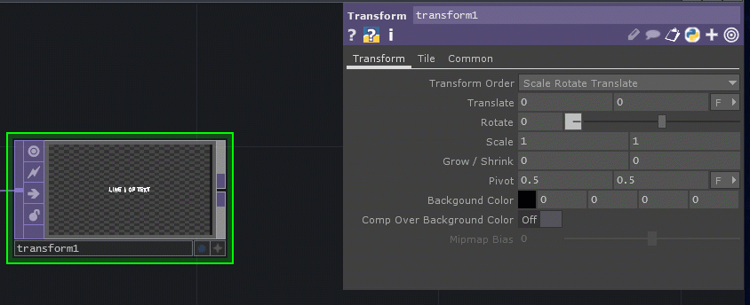
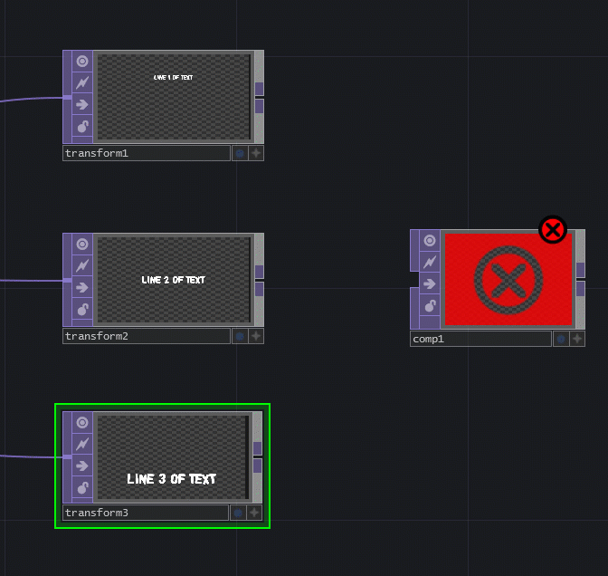

# Colorful Text

This activity uses TouchDesigner. Please see the TouchDesigner section at the end of the menu on the left for more information about the program.


New TouchDesigner projects open with an example project. Please highlight and delete those operators so the project is empty.


## Goal

The goal of this activity is to create text that has an interesting random color changing effect.

## Step 1: Add Text

### Add the first text operator

Press the Tab key or right-click and select **Add New Operator** to bring up the OP Create Dialog.

2D Text is a flat image, so we want the purple texture operators \(TOPs\).

Search for and select the Text TOP:


Click to place the operator. 



If you don't see the parameters when you click on the operator/node, press the P key or right-click and select **Parameters** to toggle the window.


### Adjust the resolution of the operator

The default resolution \(under the Common tab\) is 256 x 256. 


We want this to be the resolution of our screen \(or the largest one we can do with a free version: 1280 x 720\).

Use the drop down arrow to the right of the Resolution to select the resolution you want or type it in.


This makes the text in the operator small, but we can increase the text size.


### Adjust the font parameters

Under the Font tab, you can update the font face, style, size, alignment, etc. As you update the parameters, you can see how it looks in the operator.


To change the text, update the Text parameter under the Text tab.


Once you're happy with the style, copy the operator \(CTRL+C or right-click and select Copy\) and paste \(CTRL+V or right-click and select Paste\) as many lines or sections you plan to have.

Update the text and font to match your needs.


## Step 2: Position Text

Now, we want to _move_ or _translate_ our text sections into the correct positions.


You can move text using the Position parameter, but sometimes a Transform TOP provides more control. 


Let's use a Transform TOP!

Since the text is purple, we should stay with that color. On each output, right-click and select Transform.


Click to place the operator. It will use the resolution of the input.


Select the Transform TOP of the text you want to position and change the parameters for Translate and Rotate to position the section of text.

If you click and drag on the value you want to change with your middle/scroll button, it will bring up a list of increments. Hover over the increment you want and move right to increase and left to decrease.



## Step 3: Combine the Operators to "Layer" the Text

It will be easier to see the positioning if we have the text sections all in one operator. Let's use a Composite TOP to bring in all these operators and create one node to later display.

In an empty space to the right of the operators, press TAB or right-click and select **Add Operator** to bring up the OP Create Dialog. Search for and select the Composite TOP.


Click to place the operator.

Using your right button, click and drag to select the Transform TOPs. 

Left-click and drag from one of the Transform TOP outputs to the input of the Composite TOP. All the selected TOPs will connect to the Composite TOP.



The Composite TOP's Operation parameter is Multiply by default, so the operator will appear blank. Change the Operation to Over to see the text. This is like using a Blending Mode with layers in Photoshop.


## Step 4: Seeing a Display

You can see a display of a texture operator \(TOP\) by toggling the blue Display dot on the bottom right of the operator.


But to see a more accurate view of a final display, use a Null and Out TOP.

A **Null** operator is like a snapshot of progress.

Right-click on the Composite TOP output and add a Null TOP.

The project is looking for a texture operator named "out1" by default to display. Add this by right-clicking on the output of the Null TOP and add an Out TOP.


Now, you can preview what this looks like by clicking the Open Viewer button at the top left \(looks like a square\).


This will make it easier to see your text position.

## Step 5: Add Some Noise \(Random Color\)

Texture, surface, and channel tops all have random operators named "Noise."

We could use a Constant TOP for a single color, but let's go for a randomized rainbow.

Below the text, add a standalone Noise TOP.


It defaults to a 256 x 256 random monochrome image.

### Correct the Resolution

Bump up the Resolution to match that of our project using the Resolution parameter under the Common tab.


### Switch to Color

Under the Noise tab, turn off Monochrome.


You can change the look by changing the values, but it is static.

To get some movement, we can use the absTime \(absolute time\) class and a Python expression.

For the Harmonic Gain parameter, click on the name of the parameter to have it show more info. Click the cyan square and type in the following:

```python
absTime.seconds/5000
```

You can change the 5000 value to another number to see the effects on speed.


## Step 6: Add This Color to the Text

Since the text is white, we can just use a Composite TOP and its multiply operation to color the text.

Create another Composite TOP.

Right-click and drag to select the Null TOP and the Noise TOP. Left-click and drag from the output of one of the selected TOPs to the input of the Composite TOP.

Add a Null TOP after the Composite TOP.

Then, click and drag from the output of the new Null TOP to the line going into the Out TOP to replace the connection.


By default, where it is transparent will be black, but if you want it DEFINATELY black, the second Null TOP can be layered over a black Constant TOP \(remember to bump up the resolution\) with another Composite TOP \(use the Over operation\). 


