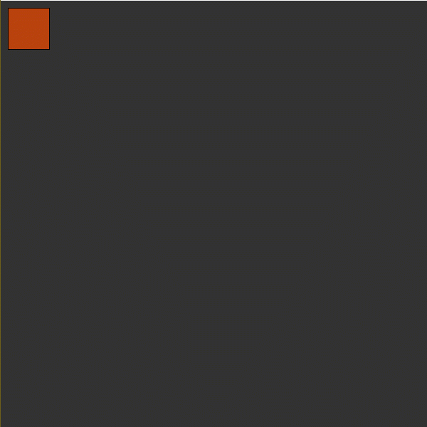

# Week 3 Moving Squares Exercise

The steps below walk you through the Processing activity we did during Week 3. All code should allow you to copy and paste.

## Step 1: Create a Canvas

Use _size\(\)_ in the setup\(\) code block to create your canvas using width and height values.

```java
void setup() {
    size(600,600);
}
```

## Step 2: Create a Square

In Processing, use the _rect\(\)_ function. The four pieces of information needed are:

1. x-coordinate
2. y-coordinate
3. width in pixels
4. height in pixes

For this example, we'll start with a 50 x 50 square with the **top left** corner at \(10, 10\).

```java
void setup() {
    size(600,600);
    
    rect(10, 10, 50, 50);
}
```

Output when played:


## Step 3: Use Variables Instead

Let's use variables instead of values in our rect\(\).

```java
float size = 50;

float x = 10;
float y = 10;

void setup() {
    size(600,600);
    
    rect(x, y, size, size);
}
```

Output when played:


## Step 4: Create the Next Square

Let's use the width of the first to determine the x coordinate of the next square. Let's put 5 pixels of space between them.

```java
x += size + 5;
```

After updating x, create the next square with the same code as the first.

Full code:

```java
float size = 50;

float x = 10;
float y = 10;

void setup() {
    size(600,600);
    
    rect(x, y, size, size);
    x += size + 5;
    rect(x, y, size, size);
}
```

Output when played:


## Step 5: Making the Sizes Different

Let's add a variable to hold a different size for the second square.

Rename "size" to "size0" for the first square and name the size variable for the second "size1".

```java
float size0 = 50;
float size1 = 65;
```

Update the names of the variables in the setup\(\) code.

Full code:

```java
float size0 = 50;
float size1 = 65;

float x = 10;
float y = 10;

void setup() {
    size(600,600);
    
    rect(x, y, size0, size0);
    x += size0 + 5;
    rect(x, y, size1, size1);
}
```

Output when played:


## Step 6: Make a Third Square

Make a third square with the same method. 

Create a variable to hold the size of the new square.

Add the width of the last square to x plus 5 more pixels for spacing.

Then create the square with the new x and the new variable.

```java
float size0 = 50;
float size1 = 65;
float size2 = 25;

float x = 10;
float y = 10;

void setup() {
    size(600,600);
    
    rect(x, y, size0, size0);
    x += size0 + 5;
    rect(x, y, size1, size1);
    x += size1 + 5;
    rect(x, y, size2, size2);
}
```

Output when played:


Step 7: Move to draw\(\)

Move everything but size\(\) to a draw\(\) code block:

```java
float size0 = 50;
float size1 = 65;
float size2 = 25;

float x = 10;
float y = 10;

void setup() {
    size(600,600);
}

void draw() {
    rect(x, y, size0, size0);
    x += size0 + 5;
    rect(x, y, size1, size1);
    x += size1 + 5;
    rect(x, y, size2, size2);
}
```

Output when played:


You'll notice the output shows only two sizes! This is because the x variable was not updated after the third square so the second square is drawn over it.

Let's fix that by updating x to add the width of the last square plus 5 pixels for spacing.

```java
float size0 = 50;
float size1 = 65;
float size2 = 25;

float x = 10;
float y = 10;

void setup() {
    size(600,600);
}

void draw() {
    rect(x, y, size0, size0);
    x += size0 + 5;
    rect(x, y, size1, size1);
    x += size1 + 5;
    rect(x, y, size2, size2);
    x += size2 + 5;
}
```

Output when played:


## Step 7: Switching to Arrays Instead of Variables

We are going to eventually add an unknown number of these rectangles, so we should put a list of the size values within one array. That way, we can add to it while the sketch is playing.

To do this, create an array variable and list the values:

```java
float[] sizes = { 50, 65, 25 };
```

Imagine each value as a one-column table starting with Row 0. The row number is the **index** number we are wanting to access.

Then, we can use the array and index as a variable by using the array name followed by the index in square brackets **\[ \]**:

```java
    rect(x, y, sizes[0], sizes[0]);
    x += sizes[0] + 5;
    rect(x, y, sizes[1], sizes[1]);
    x += sizes[1] + 5;
    rect(x, y, sizes[2], sizes[2]);
    x += sizes[2] + 5;
```

The variables we are no longer using can be removed.

Here is the full code:

```java
float[] sizes = { 50, 65, 25 };

float x = 10;
float y = 10;

void setup() {
    size(600,600);
}

void draw() {
    rect(x, y, sizes[0], sizes[0]);
    x += sizes[0] + 5;
    rect(x, y, sizes[1], sizes[1]);
    x += sizes[1] + 5;
    rect(x, y, sizes[2], sizes[2]);
    x += sizes[2] + 5;
}
```

Output when played:


## Step 8: Looping Through Array Values

The great thing about arrays is that the indices increase by 1 for each value. That means we can easily loop through a list and only have to update what index to access for information.

Here, we'll use an integer variable called i for index and start it at zero.

```java
int i = 0;
```

To loop through the code, use a **while loop**.

A while loop looks at the information in the parentheses and if that information/comparison is "true," the code following in the curly brackets { } runs. Otherwise, the code is ignored.

In this loop, we only want the code to run when i is less than 3 because the highest index in our array is 2.

```java
while (i < 3) {
    // code to run
}
```

You'll notice the code for the squares repeat. In the loop, we only need the part of the code that repeats:

```java
while (i < 3) {
    rect(x, y, sizes[0], sizes[0]);
    x += sizes[0] + 5;
}
```

Replace the index number with i so it references the number through that variable.

```java
while (i < 3) {
    rect(x, y, sizes[i], sizes[i]);
    x += sizes[i] + 5;
}
```

The variable i needs to update each time, otherwise, it will just make the same size of square forever.

So increase the variable i by 1 each time:

```java
while (i < 3) {
    rect(x, y, sizes[i], sizes[i]);
    x += sizes[i] + 5;
    i++;
}
```

Full code:

```java
float[] sizes = { 50, 65, 25 };

float x = 10;
float y = 10;

int i = 0;

void setup() {
    size(600,600);
}

void draw() {
  while (i < 3) {
    rect(x, y, sizes[i], sizes[i]);
    x += sizes[i] + 5;
    i++;
  }
}
```

Output when played:


Instead of drawing these squares each frame, it draws them once then stops because the variable i never resets after hitting 3.

To have it draw repeatedly, reset the variable i to zero at the end of draw\(\).

```java
float[] sizes = { 50, 65, 25 };

float x = 10;
float y = 10;

int i = 0;

void setup() {
    size(600,600);
}

void draw() {
  while (i < 3) {
    rect(x, y, sizes[i], sizes[i]);
    x += sizes[i] + 5;
    i++;
  }
  
  i = 0;
}
```

Output when played:


To go back to having these appear once, but drawn each frame, add a background, and reset the variable x at the end of draw\(\).

```java
float[] sizes = { 50, 65, 25 };

float x = 10;
float y = 10;

int i = 0;

void setup() {
    size(600,600);
}

void draw() {
  background(50);      // Gray background
  
  while (i < sizes.length) {
    rect(x, y, sizes[i], sizes[i]);
    x += sizes[i] + 5;
    i++;
  }
  
  i = 0;
  x = 10;
}
```

Output when played:


## Step 9: Adding Interaction

To show this array growing, let's add to the array each time the user clicks the mouse.

In Processing, there is a built-in function called mouseClicked\(\) that runs a block of code ONLY when you click \(press and release button of\) the mouse.

Put this outside of all other blocks of code/curly brackets **{ }**.

```java
void mouseClicked() {
  // Run this code when the mouse is clicked
}
```

Every time the user clicks, a size value should be added to the sizes array. This can be done with append\(\) function. update the sizes array with the function, giving it what array is being updated and what value to add to it.

This is how it looks for adding a value of 75 to sizes each time the mouse is clicked:

```java
void mouseClicked() {
  sizes = append(sizes, 75);
}
```

Full code:

```java
float[] sizes = { 50, 65, 25 };

float x = 10;
float y = 10;

int i = 0;

void setup() {
    size(600,600);
}

void draw() {
  while (i < 3) {
    rect(x, y, sizes[i], sizes[i]);
    x += sizes[i] + 5;
    i++;
  }
  
  i = 0;
}

void mouseClicked() {
  sizes = append(sizes, 75);
}
```

Output when played:


## Step 10: Adding Randomness

The values can replaced with random\(min, max\) to add randomness to the sizes.

Here, we are starting with only one value in the sizes array, a random number between 15 and 75.

```java
float[] sizes = { random(15, 75) };
```

In mouseClicked, instead of 75, we'll use the same random number range to get a random number each time we click:

```java
void mouseClicked() {
  sizes = append(sizes, random(15, 75));
}
```

Since we will have more than 3 values after clicking, we have to update our while loop. 

We want the code to run as long as the variable i is less than the length of the array. We can get this length by using .length.

When something with a period is added to the name of a variable/array/function/etc., it's a way of accessing an attribute/description within that variable. .length added to an array name provides the length of that array.

Here's the updated while loop:

```java
while (i < sizes.length) {
    rect(x, y, sizes[i], sizes[i]);
    x += sizes[i] + 5;
    i++;
  }
```

Full code:

```java
float[] sizes = { random(15, 75) };

float x = 10;
float y = 10;

int i = 0;

void setup() {
    size(600,600);
}

void draw() {
  background(50);
  
  while (i < sizes.length) {
    rect(x, y, sizes[i], sizes[i]);
    x += sizes[i] + 5;
    i++;
  }
  
  i = 0;
  x = 10;
}

void mouseClicked() {
  sizes = append(sizes, random(15, 75));
}
```

Output when played:


## Step 11: More Arrays and Randomness!

Thinking of the index number as a row number, we can make other arrays with information for row zero and beyond so that all index numbers work as if it is a row and each array is like a column in that row.

Let's add random color by adding arrays for red, green, and blue values:


Remember: Color values range from 0 \(black/no color\) to 255 \(brightest of that color\) and matching colors for all three values will result in shades of gray.


```java
float[] red = { random(0, 255) };
float[] green = { random(0, 255) };
float[] blue = { random(0, 255) };
```

Since we are creating arrays, we need to add to them at the same time as the sizes array -- in the mouseClicked\(\) function:

```java
void mouseClicked() {
  sizes = append(sizes, random(15, 75));
  red = append(red, random(0, 255));
  green = append(green, random(0, 255));
  blue = append(blue, random(0, 255));
}
```

In the while loop, we need to tell the computer to give the squares a color using fill\(red, green, blue\).

```java
while (i < sizes.length) {
    fill(red[i], green[i], blue[i]);
    rect(x, y, sizes[i], sizes[i]);
    x += sizes[i] + 5;
    i++;
}
```

Remember to have the brackets with the i variable so the computer knows WHAT red, green, and blue values to get since there will be multiple.

Full code:

```java
float[] sizes = { random(15, 75) };
float[] red = { random(0, 255) };
float[] green = { random(0, 255) };
float[] blue = { random(0, 255) };

float x = 10;
float y = 10;

int i = 0;

void setup() {
    size(600,600);
}

void draw() {
  background(50);
  
  while (i < sizes.length) {
    fill(red[i], green[i], blue[i]);
    rect(x, y, sizes[i], sizes[i]);
    x += sizes[i] + 5;
    i++;
  }
  
  i = 0;
  x = 10;
}

void mouseClicked() {
  sizes = append(sizes, random(15, 75));
  red = append(red, random(0, 255));
  green = append(green, random(0, 255));
  blue = append(blue, random(0, 255));
}
```

Output when played:



## Step 12: Adding Movement

We can even make a coordinate be related to a specific square on the list by making the y position its own array.

We'll set the first at the y coordinate 10:

```java
float[] yPos = { 10 };
```


Remember to remove the original y variable.


Since we made it an array, we should update it with the others in mouseClicked\(\).

We'll use 10 as the value so each square starts at the same y value.

```java
void mouseClicked() {
  sizes = append(sizes, random(15, 75));
  red = append(red, random(0, 255));
  green = append(green, random(0, 255));
  blue = append(blue, random(0, 255));
  yPos = append(yPos, 10);
}
```

Now the yPos value for each square can update on each frame if we update it in the while loop.

REMEMBER: Update y in the rect\(\) code to be yPos\[i\] so it references the y coordinate of the specific square.

```java
while (i < sizes.length) {
    fill(red[i], green[i], blue[i]);
    rect(x, yPos[i], sizes[i], sizes[i]);
    x += sizes[i] + 5;
    yPos[i] += 0.5;
    i++;
}
```

Full code:

```java
float[] sizes = { random(15, 75) };
float[] red = { random(0, 255) };
float[] green = { random(0, 255) };
float[] blue = { random(0, 255) };
float[] yPos = { 10 };

float x = 10;

int i = 0;

void setup() {
    size(600,600);
}

void draw() {
  background(50);
  
  while (i < sizes.length) {
    fill(red[i], green[i], blue[i]);
    rect(x, yPos[i], sizes[i], sizes[i]);
    x += sizes[i] + 5;
    yPos[i] += 0.5;
    i++;
  }
  
  i = 0;
  x = 10;
}

void mouseClicked() {
  sizes = append(sizes, random(15, 75));
  red = append(red, random(0, 255));
  green = append(green, random(0, 255));
  blue = append(blue, random(0, 255));
  yPos = append(yPos, 10);
}
```

Output when clicked:


## Step 13: Introducing If Statements

So the squares run off the screen at the moment, so let's use a conditional statement that looks at whether the square will be drawn off the screen.

if statements look at the information in parentheses and run if the information is true -- just like our while loop!

```markup
if (test if true) {
    // code to run if true
}
```

We can get the length of the canvas with the built-in variable _width_.

We want to reset the variable x to zero when the width of the square exceeds the canvas.

The width and x position will be available before drawing the square, so let's test this at the beginning of the while loop.

```java
if (x + sizes[i] > width) {
  // run this code if true
}
```

If the square is too big, reset x to the original 10:

```java
if (x + sizes[i] > width) {
  x = 10;
}
```

## Full code

```java
float[] sizes = { random(15, 75) };
float[] red = { random(0, 255) };
float[] green = { random(0, 255) };
float[] blue = { random(0, 255) };
float[] yPos = { 10 };

float x = 10;

int i = 0;

void setup() {
    size(600,600);
}

void draw() {
  background(50);
  
  while (i < sizes.length) {
    
    if (x + sizes[i] > width) {
      x = 10;
    }
    
    fill(red[i], green[i], blue[i]);
    rect(x, yPos[i], sizes[i], sizes[i]);
    x += sizes[i] + 5;
    yPos[i] += 0.5;
    i++;
  }
  
  i = 0;
  x = 10;
}

void mouseClicked() {
  sizes = append(sizes, random(15, 75));
  red = append(red, random(0, 255));
  green = append(green, random(0, 255));
  blue = append(blue, random(0, 255));
  yPos = append(yPos, 10);
}
```

Output when played:


