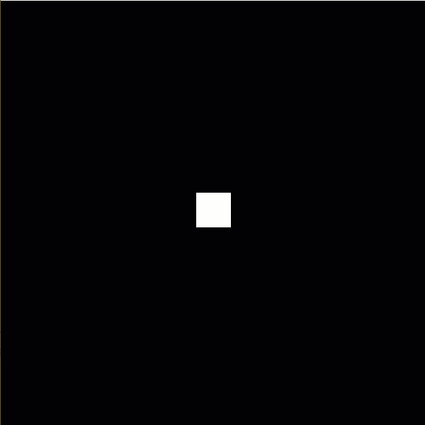
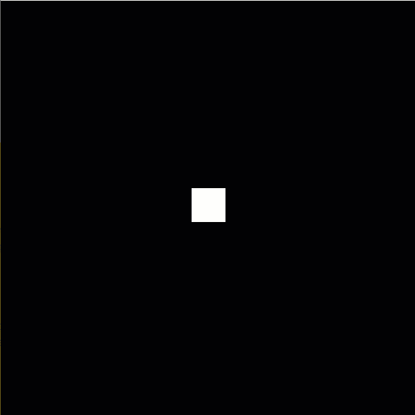

# Week 4-B Boundaries Using If Statements

The steps below walk you through continuing the Processing activity we did during Week 4. All code should allow you to copy and paste.

## Starting Code

This page is a continuation of Week 4-A. Below is the code:

```java
float x = 300;
float y = 300;
float size = 50;
float speed = 5;

void setup() {
    size(600, 600);        // Creates a 600 x 600 canvas
    
    // Change rectMode() to draw the origin (x, y) coordinates in the center of the square
    rectMode(CENTER);
    
    // Draw a black background
    background(0);      // Equivalent to background(0, 0, 0);
    
    // Create a square at the coordinates provided in the variables
    rect(x, y, size, size);    
}

void draw() {
}

void keyPressed() {
  
  // Go up if 'w' or 'W' is pressed
  if (key == 'w' || key == 'W') {
    y -= speed;
  }
  
  // Go down if 's' or 'S' is pressed
  if (key == 's' || key == 'S') {
    y += speed;
  }
  
  // Go left if 'a' or 'A' is pressed
  if (key == 'a' || key == 'A') {
    x -= speed;
  }
  
  // Go right if 'd' or 'D' is pressed
  if (key == 'd' || key == 'D') {
    x += speed;
  }
  
  background(0);
  rect(x, y, size, size);
}
```

## Step 1: Imagine the "Real" Boundaries

The current rectMode() puts the x and y coordinates in the middle.

If we try to restrain the x and y coordinates to the borders of our canvas, at least half the player square will be off the canvas. We need to **add** half the size of our player square to our "lower bounds" (lowest number we want our x and y values) and **subtract** half the size of our player square from our "upper bounds" (highest number we want our x and y values).

We want to check to see if x and y are out of these bounds. When they are, we want to reset them to be at the nearest bound.

Half the size of our player object will be used a lot as a kind of offset, so let's put it in its own variable at the top:

```java
float offset = size/2;
```

## Step 2: Test Trying to Go Past One of the Boundaries

Have the variable update prior to drawing the square to make it appear that the square never leaves the canvas.

Start with Y to test.


The zero is not needed here, but I left it in to represent the y coordinate.


```java
...

  // Go right if 'd' or 'D' is pressed
  if (key == 'd' || key == 'D') {
    x += speed;
  }
  
  // Check if y is less than 0 / going off the top of the canvas
  // If it is, reset y to 0 PLUS half the size of the square
  if (y < 0 + offset) {
    y = 0 + offset;
  }
  
  background(0);
  rect(x, y, size, size);
}
```

Output when played:



## Step 2: Add the Other Boundaries

Copy and paste or practice typing the if statement for the upper bound of y (the bottom of the canvas).

Instead of zero, we want to get the height. The variable **height** is a built-in variable that is equal to the height of the canvas.

```java
...

  // Go right if 'd' or 'D' is pressed
  if (key == 'd' || key == 'D') {
    x += speed;
  }
  
  // Check if y is less than 0 / going off the top of the canvas
  // If it is, reset y to 0 PLUS the offset
  if (y < 0 + offset) {
    y = 0 + offset;
  }
  
  // Check if y is greater than the height / going off the bottom of the canvas
  // If it is, reset y to the height MINUS the offset
  if (y > height - offset) {
    y = height - offset;
  }
  
  background(0);
  rect(x, y, size, size);
}
```

Output when played:



Now, copy both of those if statements and paste them or practice typing and update the statements for the x axis and the width.

```java
...

  // Go right if 'd' or 'D' is pressed
  if (key == 'd' || key == 'D') {
    x += speed;
  }
  
  // Check if y is less than 0 / going off the top of the canvas
  // If it is, reset y to 0 PLUS the offset
  if (y < 0 + offset) {
    y = 0 + offset;
  }
  
  // Check if y is greater than the height / going off the bottom of the canvas
  // If it is, reset y to the height MINUS the offset
  if (y > height - offset) {
    y = height - offset;
  }
  
  // Check if x is less than 0 / going off the left side of the canvas
  // If it is, reset x to 0 PLUS the offset
  if (x < 0 + offset) {
    x = 0 + offset;
  }
  
  // Check if x is greater than the width / going off the right side of the canvas
  // If it is, reset x to the width MINUS the offset
  if (x > width - offset) {
    x = width - offset;
  }
  
  background(0);
  rect(x, y, size, size);
}
```

## Full Code

```java
float x = 300;
float y = 300;
float size = 50;
float speed = 5;
float offset = size/2;

void setup() {
    size(600, 600);        // Creates a 600 x 600 canvas
    
    // Change rectMode() to draw the origin (x, y) coordinates in the center of the square
    rectMode(CENTER);
    
    // Draw a black background
    background(0);      // Equivalent to background(0, 0, 0);
    
    // Create a square at the coordinates provided in the variables
    rect(x, y, size, size);    
}

void draw() {
}

void keyPressed() {
  
  // Go up if 'w' or 'W' is pressed
  if (key == 'w' || key == 'W') {
    y -= speed;
  }
  
  // Go down if 's' or 'S' is pressed
  if (key == 's' || key == 'S') {
    y += speed;
  }
  
  // Go left if 'a' or 'A' is pressed
  if (key == 'a' || key == 'A') {
    x -= speed;
  }
  
  // Go right if 'd' or 'D' is pressed
  if (key == 'd' || key == 'D') {
    x += speed;
  }
  
  // Check if y is less than 0 / going off the top of the canvas
  // If it is, reset y to 0 PLUS the offset
  if (y < 0 + offset) {
    y = 0 + offset;
  }
  
  // Check if y is greater than the height / going off the bottom of the canvas
  // If it is, reset y to the height MINUS the offset
  if (y > height - offset) {
    y = height - offset;
  }
  
  // Check if x is less than 0 / going off the left side of the canvas
  // If it is, reset x to 0 PLUS the offset
  if (x < 0 + offset) {
    x = 0 + offset;
  }
  
  // Check if x is greater than the width / going off the right side of the canvas
  // If it is, reset x to the width MINUS the offset
  if (x > width - offset) {
    x = width - offset;
  }
  
  background(0);
  rect(x, y, size, size);
}
```

Output when played and using WASD controls:


