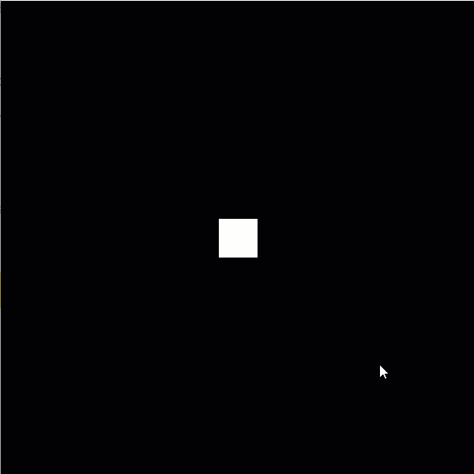

# Week 4-C Hover, Click, and Drag Effects


This page uses the variables and setup code of Week 4-B.


Below is starting code from Week 4-B:

```java
float x = 300;
float y = 300;
float size = 50;
float speed = 5;
float offset = size/2;

void setup() {
    size(600, 600);        // Creates a 600 x 600 canvas
    
    // Change rectMode() to draw the origin (x, y) coordinates in the center of the square
    rectMode(CENTER);
    
    // Draw a black background
    background(0);      // Equivalent to background(0, 0, 0);
    
    // Create a square at the coordinates provided in the variables
    rect(x, y, size, size);    
}

void draw() {
}
```

## Step 1: Determine the Boundaries of the Interactable Object

Let's use the player square as the interactable object. We want it to trigger code when the mouse cursor is located within the boundaries of the object.

We can get the coordinates of the cursor with the built-in variables **mouseX** and **mouseY**.

| Boundary | Description | Code |
| :--- | :--- | :--- |
| Left Side | left offset of x coord \(center\) | mouseX &gt; x - offset |
| Right Side | right offset of x coord \(center\) | mouseX &lt; x + offset |
| Top Part | offset above the y coord \(center\) | mouseY &gt; y - offset |
| Bottom Part | offset below the y coord \(center\) | mouseY &lt; y + offset |

Using the x and y coordinates and the size \(or square height and width\) makes the hover and click effects work wherever the player square is and at any size.

## Step 2: Define the Boundaries in the If Statement

We can check each of these boundaries in their own if statements within if statements looking like this:

```java
if (mouseX > x - offset) {
    if (mouseX < x + offset) {
        if (mouseY > y - offset) {
            if (mouseY < y + offset) {
                // run the code
            }
        }
    }
}
```

But we don't need four different if statements when we can combine them all in one using the and \(&&\) logical operator. 

In one if statement, put all four tests and separate them with the operator && :

```java
if (mouseX > x - offset && mouseX < x + offset && mouseY > y - offset && mouseY < y + offset) {
    // run the code
}
```

## Step 3: Add the Code to Trigger When Hovering

In this example, let's have the player square change color when we hover the mouse over it.

We can add color variables using the "color" type to hold the color values \(either grayscale, or red, green, and blue, and even alpha!\) instead of creating variables separately for each one.

```java
// Colors
color defaultColor = color(255);      // White and equivalent to color(255, 255, 255);
color hoverColor = color(255, 0, 0);  // Red

color squareColor = defaultColor;
```

We are using mouseX and mouseY, so we want to check it on every frame. So add the hover boundary code to the draw\(\) function.

We want the player square to draw each frame to show any changes, so add a background, a fill color using the square color, and rect\(\) code using the player square values.

```java
...

void draw() {
  if (mouseX > x - offset && mouseX < x + offset && mouseY > y - offset && mouseY < y + offset) {
    squareColor = hoverColor;
  }
  
  background(0);
  fill(squareColor);
  rect(x, y, size, size);
}
```

Output when played:



## Step 4: Add Else Statement

As you can see, the square never goes back to the default color. One way we can have it be the default color whenever the cursor is outside the bounds is through adding an else statement that only runs when the test in the if statement is **false**:

```java
...

void draw() {
  if (mouseX > x - offset && mouseX < x + offset && mouseY > y - offset && mouseY < y + offset) {
    squareColor = hoverColor;
  }
  else {
    squareColor = defaultColor;
  }
  
  background(0);
  fill(squareColor);
  rect(x, y, size, size);
}
```

Output when played:


## Step 5: Add a Click Effect

So let's see how the same idea of using boundaries can be used for click effects.

Processing has a built-in function called **mouseClicked\(\)** that runs code within its block whenever the user clicks a mouse button.

Copy and paste the if statement with the boundaries within the mouseClicked\(\) code.

Inside the if statement block, put code to run when the square is clicked. Here, the size of the square increases by 5 each time it is clicked.

```java
void mouseClicked() {
  if (mouseX > x - offset && mouseX < x + offset && mouseY > y - offset && mouseY < y + offset) {
    size += 5;
  }
}
```


If it does not react to clicks, make sure you are not accidentally moving while clicking. Moving appears as a mouseDragged\(\) instead of mouseClicked\(\).


Output when played:


## Step 6: Adding Dragging Effects

Processing also has a built-in dragging effects with the function **mouseDragged\(\)**.

Let's use mouseDragged\(\) and the player square's boundaries to drag the square around:

```java
void mouseDragged() {
  if (mouseX > x - offset && mouseX < x + offset && mouseY > y - offset && mouseY < y + offset) {
    x = mouseX;
    y = mouseY;
  }
}
```

Since mouseDragged\(\) only fires when a mouse button is pressed and moving, the x and y coordinates will stop updating once the user releases the button.

Output when played:


If you move too fast, you might move out of the boundaries and the square will not follow until you drag it again.



## Full Code

```java
float x = 300;
float y = 300;
float size = 50;
float speed = 5;
float offset = size/2;

// Colors
color defaultColor = color(255);      // White and equivalent to color(255, 255, 255);
color hoverColor = color(255, 0, 0);  // Red

color squareColor = defaultColor;

void setup() {
    size(600, 600);        // Creates a 600 x 600 canvas
    
    // Change rectMode() to draw the origin (x, y) coordinates in the center of the square
    rectMode(CENTER);
    
    // Draw a black background
    background(0);      // Equivalent to background(0, 0, 0);
    
    // Create a square at the coordinates provided in the variables
    rect(x, y, size, size);    
}

void draw() {
  if (mouseX > x - offset && mouseX < x + offset && mouseY > y - offset && mouseY < y + offset) {
    squareColor = hoverColor;
  }
  else {
    squareColor = defaultColor;
  }
  
  background(0);
  fill(squareColor);
  rect(x, y, size, size);
}

void mouseClicked() {
  if (mouseX > x - offset && mouseX < x + offset && mouseY > y - offset && mouseY < y + offset) {
    size += 5;
  }
}

void mouseDragged() {
  if (mouseX > x - offset && mouseX < x + offset && mouseY > y - offset && mouseY < y + offset) {
    x = mouseX;
    y = mouseY;
  }
}
```

