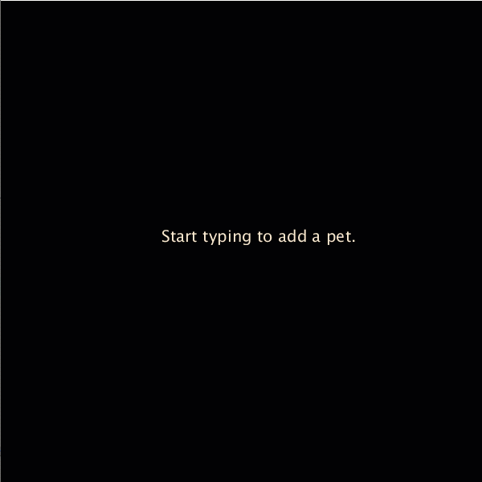
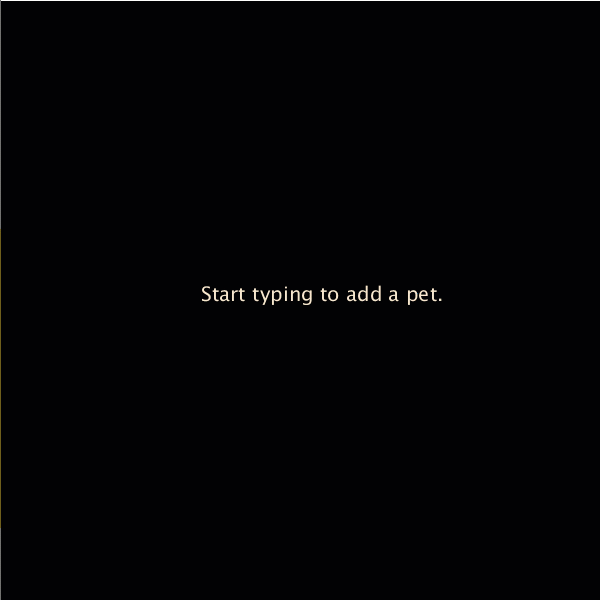
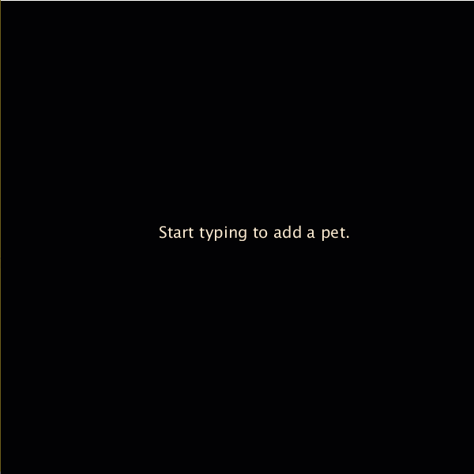

# Week 5-C Using User Input to Create Arrays

Continuing the code from Week 5-B:

```java
String[] pets = { "dog", "igauna", "hamster", "parrot", "goldfish" };
float y = 50;
float spacing = 25;

void setup() {
  // Creates a canvas 600 pixels by 600 pixels
  size(600, 600);
}

void draw() {
  background(0);      // Black
  fill(247, 231, 206);      // Champagne color
  noStroke();      // No outline color
  
  // Sets a size for the text
  textSize(20);
  
  for (int i = 0; i < pets.length; i++) {
    text(pets[i], 50, y);
    y += spacing;
  }
  
  y = 50;
}
```

## Step 1: Clear the Array

```java
String[] pets = {  }; 
```

## Step 2: Visual Feedback of Input

The user needs to see what they are typing, otherwise it gets confusing.

Create a text area for this with a default message.

```java
String[] pets = { };
float y = 50;
float spacing = 25;

String message = "Start typing to add a pet.";

void setup() {
  // Creates a canvas 600 pixels by 600 pixels
  size(600, 600);
}

void draw() {
  background(0);      // Black
  fill(247, 231, 206);      // Champagne color
  noStroke();      // No outline color
  
  // Sets a size for the text
  textSize(20);
  
  // Display a default message where the user input will appear
  text(message, 200, 300);
  
  // Display the array
  for (int i = 0; i < pets.length; i++) {
    text(pets[i], 50, y);
    y += spacing;
  }
  
  y = 50;
}
```

Output when played:


## Step 3: Update the Message

Use keyPressed\(\) after and outside the draw\(\) function to see when the user starts using the keyboard.

```java
void keyPressed() {
  
}
```

When the user presses a button, update the message.

```java
void keyPressed() {
  
  // The key presses appears as a CHAR type, but we need it to be a String
  // Use str() to turn the CHAR into a String
  
  message = str(key);
}
```

Output when played:


Right now, the message is updating one character at a time.

We can add to an existing message using the += operator.

```java
void keyPressed() {
  
  // The key presses appears as a CHAR type, but we need it to be a String
  // Use str() to turn the CHAR into a String
  
  message += str(key);
}
```

Output when played:



So we can add to a message, but we need to:

1. Say when to reset the message to blank
2. Say when the message is finished

That can be done with if statements!

Let's make a boolean variable to say when the message is being edited.

```java
boolean editing = false;
```

Once the user starts typing, if the message isn't already being edited, it needs to reset to blank.

Add an if statement to the keyPressed\(\) function:

```java
void keyPressed() {
  
  // If the message is being edited, continue adding to the message
  if (editing == true) {
    message += str(key);
  }
  
  // Otherwise, reset the message, add the first letter, and turn on editing
  else {
    message = "";
    message += str(key);
    editing = true;
  }
}
```

Output when played:



The keyPressed\(\) function can see when the ENTER or RETURN key is pressed. This could be a good way to "submit" the message or end editing.

Instead of **key**, these special buttons used **keyCode**.

Here, both ENTER and RETURN are used so it will work on both Windows \(ENTER\) and Mac \(RETURN\).

```java
    if (keyCode == ENTER || keyCode == RETURN) {
        editing = false;
    }
```

Full code so far:

```java
String[] pets = { };
float y = 50;
float spacing = 25;

String message = "Start typing to add a pet.";
boolean editing = false;

void setup() {
  // Creates a canvas 600 pixels by 600 pixels
  size(600, 600);
}

void draw() {
  background(0);      // Black
  fill(247, 231, 206);      // Champagne color
  noStroke();      // No outline color
  
  // Sets a size for the text
  textSize(20);
  
  // Display a default message where the user input will appear
  text(message, 200, 300);
  
  // Display the array
  for (int i = 0; i < pets.length; i++) {
    text(pets[i], 50, y);
    y += spacing;
  }
  
  y = 50;
}

void keyPressed() {
  
  // If the message is being edited, continue adding to the message
  if (editing == true) {
    message += str(key);
  }
  
  // Otherwise, reset the message, add the first letter, and turn on editing
  else {
    message = "";
    message += str(key);
    editing = true;
  }
  
  if (keyCode == ENTER || keyCode == RETURN) {
    editing = false;
  }
}
```

Output when played:


This is what it looks like when pressing ENTER or RETURN at the end of a message.

## Step 4: Adding Messages to the Array

We now have the variable message to use.

It can be added to the array when ENTER or RETURN.

```java
...

    if (keyCode == ENTER || keyCode == RETURN) {
        editing = false;
        
        // Add the message to pets
        pets = append(pets, message);
    }
```

Full code so far:

```java
String[] pets = { };
float y = 50;
float spacing = 25;

String message = "Start typing to add a pet.";
boolean editing = false;

void setup() {
  // Creates a canvas 600 pixels by 600 pixels
  size(600, 600);
}

void draw() {
  background(0);      // Black
  fill(247, 231, 206);      // Champagne color
  noStroke();      // No outline color
  
  // Sets a size for the text
  textSize(20);
  
  // Display a default message where the user input will appear
  text(message, 200, 300);
  
  // Display the array
  for (int i = 0; i < pets.length; i++) {
    text(pets[i], 50, y);
    y += spacing;
  }
  
  y = 50;
}

void keyPressed() {
  
  // If the message is being edited, continue adding to the message
  if (editing == true) {
    message += str(key);
  }
  
  // Otherwise, reset the message, add the first letter, and turn on editing
  else {
    message = "";
    message += str(key);
    editing = true;
  }
  
  if (keyCode == ENTER || keyCode == RETURN) {
    editing = false;
    
    // Add the message to pets
    pets = append(pets, message);
  }
}
```

Output when played:


## Step 5: Polishing

Add a BACKSPACE option in case there's a mistake.

Instead of adding, the message should be the same except for the last letter. This can be done with a substring.

The length of a string value can be accessed through its length\(\) property.

```java
  ...
  
  // If the message is being edited, continue adding to the message
  if (editing == true) {
    
    // Backspace will only work during editing and when the message has letters
    if (keyCode == BACKSPACE && message.length() > 1) {
      message = message.substring(0, message.length() - 1);
    }
    
    // Otherwise, the key is probably a letter, so add it to the message
    else {
      message += str(key);
    }
  }
  
  ...
```

Instead of showing the last message, the prompt message could be shown after submitting an entry to the list.

```java
...

  if (keyCode == ENTER || keyCode == RETURN) {
    editing = false;
    
    // Add the message to pets
    pets = append(pets, message);
    
    // Reset the prompt
    message = "Start typing to add a pet.";
  }
  
...
```

HOWEVER, if you press ENTER or RETURN, it puts an empty entry to the array.

Fix this by moving it into the "if \(editing == true\)" statement and putting in as an else if statement as a second option after Backspace.

Add one more if statement to only add entries that have an actual message

```java
...

void keyPressed() {
  
  // If the message is being edited, continue adding to the message
  if (editing == true) {
    
    // Backspace will only work during editing and when the message has letters
    if (keyCode == BACKSPACE && message.length() > 1) {
      message = message.substring(0, message.length() - 1);
    }
    
    else if (keyCode == ENTER || keyCode == RETURN) {
      editing = false;
      
      // Avoid adding blank etries
      if (message.length() > 1) {
        // Add the message to pets
        pets = append(pets, message);
      }
      
      // Reset the prompt
      message = "Start typing to add a pet.";
    }
    
    // Otherwise, the key is probably a letter, so add it to the message
    else {
      message += str(key);
    }
  }
  
  // Otherwise, reset the message, add the first letter, and turn on editing
  else {
    message = "";
    message += str(key);
    editing = true;
  }
}
```

## Full Code

```java
String[] pets = { };
float y = 50;
float spacing = 25;

String message = "Start typing to add a pet.";
boolean editing = false;

void setup() {
  // Creates a canvas 600 pixels by 600 pixels
  size(600, 600);
}

void draw() {
  background(0);      // Black
  fill(247, 231, 206);      // Champagne color
  noStroke();      // No outline color
  
  // Sets a size for the text
  textSize(20);
  
  // Display a default message where the user input will appear
  text(message, 200, 300);
  
  // Display the array
  for (int i = 0; i < pets.length; i++) {
    text(pets[i], 50, y);
    y += spacing;
  }
  
  y = 50;
}

void keyPressed() {
  
  // If the message is being edited, continue adding to the message
  if (editing == true) {
    
    // Backspace will only work during editing and when the message has letters
    if (keyCode == BACKSPACE && message.length() > 1) {
      message = message.substring(0, message.length() - 1);
    }
    
    else if (keyCode == ENTER || keyCode == RETURN) {
      editing = false;
      
      // Avoid adding blank etries
      if (message.length() > 1) {
        // Add the message to pets
        pets = append(pets, message);
      }
      
      // Reset the prompt
      message = "Start typing to add a pet.";
    }
    
    // Otherwise, the key is probably a letter, so add it to the message
    else {
      message += str(key);
    }
  }
  
  // Otherwise, reset the message, add the first letter, and turn on editing
  else {
    message = "";
    message += str(key);
    editing = true;
  }
}
```

Output when played:



