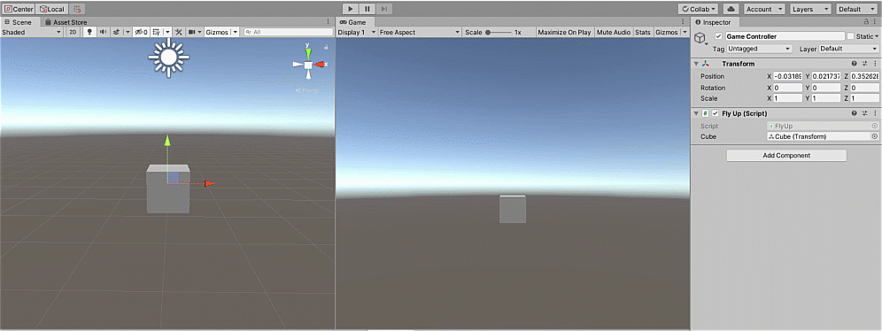
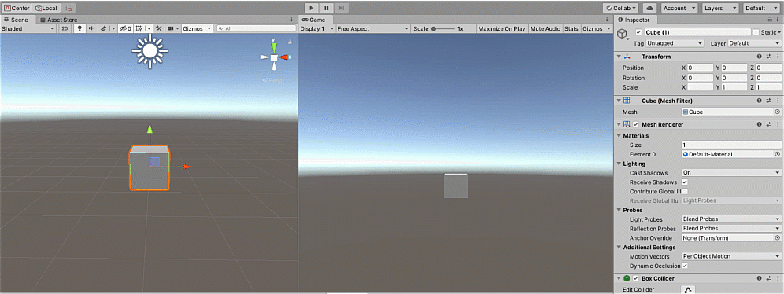
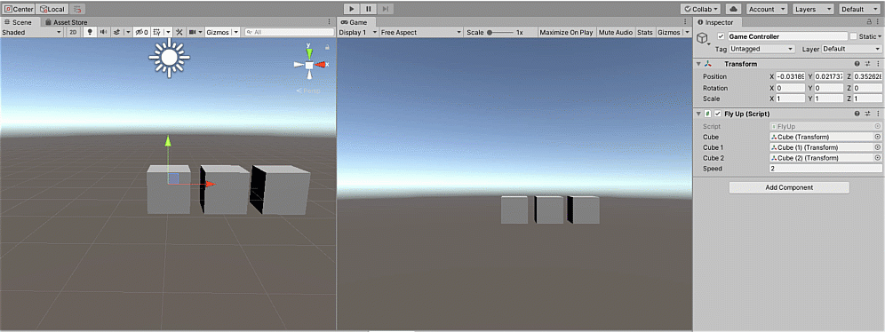
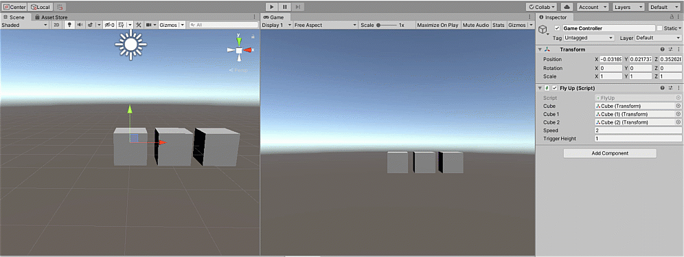
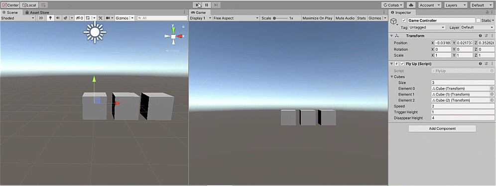
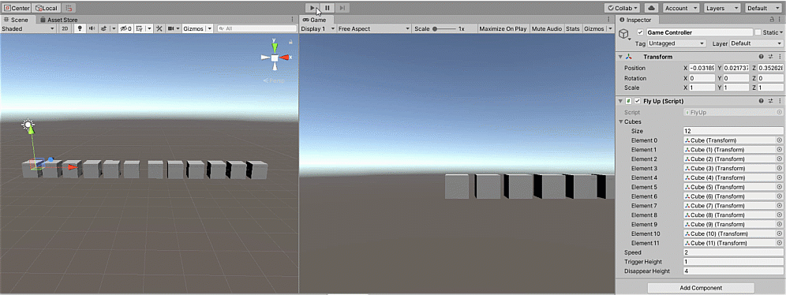

# Week 5-D For and Foreach Loops in Unity

The steps below walk you through a Unity activity we did during Week 5. All code should allow you to copy and paste.


Be sure to download Visual Studio to make it easier to code in C\# for Unity. Download it here:   
[https://visualstudio.microsoft.com/vs/community/](https://visualstudio.microsoft.com/vs/community/)


## Step 1: Create a New Unity Project

As long as you use a version no more than about 2 years old \(2018-present\), this should all be similar.

Here, I'm using Unity Hub, but it should be similar in the Unity standalone version.

1. Click on the "New" button.
2. Choose 3D.
3. Name your project.
4. Find and select the folder your project will be in. It will create a folder named the same as your project name.
5. Click the Create button.


This will set up a new project and open a user interface similar to this default layout:


New projects \(default layout\) will have the following Tabs/Windows:

1. **Hierarchy** - Has a list of the items in the current scene
2. **Scene** - The "canvas" of sorts that allows you to see the objects visually from all different angles
3. **Project** - List/folder structure of reusable parts of your project \(materials, audio clips, animations, scripts, prefabs, etc.\) ALSO - scenes
4. **Inspector** - Shows "components" or pieces of script that shows aspects of the selected item in an interface that you can directly update and monitor
5. **Game** \(Hidden\) - Shows what the player sees through a camera object in the game
6. **Console** \(Hidden\) - Shows messages and errors from the scripts

I like to see both the Scene and Game at the same time as well as my Project and Console windows at the same time. Each of these tabs are movable and snap to sides.

Here's what my layout looks like:


For more info \(including camera movements and options in each tab/window, check out the Unity Basics gitbook I'm working on:

**&gt;&gt;** [**The Default Interface**](https://hopemoore.gitbook.io/unity-basics/the-unity-interface/the-default-interface)  
**&gt;&gt;** [**The Windows \(Tabs\)**](https://hopemoore.gitbook.io/unity-basics/the-unity-interface/the-tabs)\*\*\*\*

## **Step 2: Add an Object**

Instead of having to code the creations of primitive shapes, we can simply add them.

In the Hierarchy window, right click, then choose a primitive shape under "3D Object" For this exercise, I'll be using cubes.


My default appears like this:



If you cannot see your object in the Scene window, select the object in the Hierarchy window. Then hover over the Scene window and press the F key to "focus" on the selected item. You can select multiple items to bring them all into frame.


I am going to use my right mouse button and middle button to rotate the scene to have the red X-axis on the gizmo on the top right to be on the right side:


This means moving the object to the left will move it into the negative end of X and right will be positive numbers.

Speaking of positioning...

## Step 3: Reset the Position

When you create an object, it might use the position, rotation, and size from another object.

Each game object has a **Transform** component that holds and displays the position, rotation, and scale \(size\) of the object.

Select the cube and you should see this Transform info in the **Inspector** window.


**Note:** Obviously, there are several other components for the shape, but we are focusing on the Transform for this exercise.

To reset the position and rotation to zeros and the scale to 1 x 1 x 1, right click on "Transform" and click "Reset."


It should now look like this:



You might have to refocus in the Scene window \(press F\).


## Step 4: Add a Script

In this script, we are making our shape fly upward.

In the Project window, right-click and choose Create &gt; C\# Script


It will appear like this, ready to give the script a name:


I'm naming this FlyUp.cs



Names are in Pascal casing and no spaces. It must match the class name within the script, so any renaming here needs to also happen within the script.


## Step 5: Add the Code

Double-click on the script. It should load Visual Studio with default code:

```csharp
using System.Collections;
using System.Collections.Generic;
using UnityEngine;

public class FlyUp : MonoBehaviour
{
    // Start is called before the first frame update
    void Start()
    {
        
    }

    // Update is called once per frame
    void Update()
    {
        
    }
}
```

**Start\(\)** is like setup\(\) in Processing - it runs once and on the first frame

**Update\(\)** is like draw\(\) in Processing - it runs once per frame and loops indefinately

To affect the cube, we'll put it in an variable above and outside of Start\(\):

```csharp
public Transform cube;
```

**public** is the _**scope**_ of the variable - public will allow it to be used by multiple blocks of code/functions within this script as well as other scripts AND it makes it visible in the Inspector window.

**Transform** is the type of variable - we are using this variable to access the Transform component \(and thus, the stored info for position, rotation, and scale\) of the cube.

The name of the variable is like any other - use camel casing and no spaces!

We do not need to set what this variable is because we will do it through the user interface.

Inside the Update\(\) function, we want to update the cube to add to the y-axis.

The LONG way would look something like this:

```csharp
cube.position += new Vector3(0, 1, 0);
```

Here, we are using the . \(dot\) to access position information in cube.

We are adding to the Y value. Unity doesn't like updating just one axis, so a full Vector3 \(a set of x, y, z coordinates\) needs to be defined.

Here is a shorthand way to do the same thing:

```csharp
cube.position += Vector3.up;
```

Hovering over the "up" in Visual Studio will show this hint:


These shorthands exist for left, right, up, down, forward, and back and adjust the appropriate axis by 1. MEANING we can multiply modifiers to affect speed, etc.

Our code so far:

```csharp
using System.Collections;
using System.Collections.Generic;
using UnityEngine;

public class FlyUp : MonoBehaviour
{
    public Transform cube;

    // Start is called before the first frame update
    void Start()
    {
        
    }

    // Update is called once per frame
    void Update()
    {
        cube.position += Vector3.up;
    }
}
```

## Step 6: Add the Script to the Scene

Save your script.

Go back to Unity.

We'll be using this script for multiple items, so lets create an empty game object to hold our scripts.

In Hierarchy, right click and select "Create Empty."


Once created, you can rename it by selecting it and single clicking it.

I named mine "Game Controller" \(out of habit\), but you can name it whatever works for you.

Select the empty game object.

Click and drag the script into the Inspector tab to add it to the game object.


Here's what the Inspector looks like with Game Controller selected:


Don't worry about the Transform here since we are concerned only with the added scripts/components.

You'll notice our variable appears and is currently "None" and looking for a object with a Transform component.

You can click and drag the cube from the Hierarchy window OR click the bull's eye symbol on the right side of the variable to bring up a list of possible objects in your scene.


Double-click on cube \(or whatever your shape is\).

It now shows as stored as our cube variable:


## Step 7: Test the Code

Click the play button at the top of the screen.

Output when played:




My settings have my screen turn green when I hit play. Yours might not change color.


## Step 8: Use Time.deltaTime to Regulate Speed

My computer is running around 60 frames per second, so this cube is going up 1 unit per frame. 

Time.deltaTime changes this to make it about a unit per second no matter what frame rate.

Let's go back to the script...    

Since we are using Time.deltaTime as a modifier, multiply it to the Vector.up

```csharp
cube.position += Vector3.up * Time.deltaTime;
```

Save the script.

Go back to Unity and test it again...


## Step 9: Adding a Speed Modifier

We might want to modify how fast this is flying up, so let's add a speed modifier.

Go to your script.

Add a variable named speed that holds a float. It doesn't matter what you initialize speed to since you can update it in Unity.

```csharp
public float speed = 5;
```

Now, multiply it to your Vector3.up line. It doesn't matter where since it's multiplication. I will add it right after the Vector3.up.

```csharp
cube.position += Vector3.up * speed * Time.deltaTime;
```

Code so far:

```csharp
using System.Collections;
using System.Collections.Generic;
using UnityEngine;

public class FlyUp : MonoBehaviour
{
    public Transform cube;
    public float speed = 5;

    // Start is called before the first frame update
    void Start()
    {
        
    }

    // Update is called once per frame
    void Update()
    {
        cube.position += Vector3.up * speed * Time.deltaTime;
    }
}
```

Save the script and go back to Unity.

It will update and the FlyUp component on Game Controller will have the new variable.


You can now adjust this speed and it will modify the speed in which the cube moves up.

## Step 10: Add More Cubes

Click on your cube \(or other shape\).

You can right-click copy and right-click paste, use CTRL+C / CTRL+V, OR what I like doing: CTRL+D to **duplicate**.

This makes a copy and adds a number after the name.


It also duplicates the position, rotation, and scale, so it will be overlapping the first.

Use the coordinates in the Transform object OR click the move tool button on the top left and click and drag the vectors.




Do this again for a third cube.


Go back to your FlyUp script.

Add variables for the new cubes:

```csharp
public Transform cube1;
public Transform cube2;
```

Copy and past the code in Update\(\) and update it to apply to the new cubes.

```csharp
cube1.position += Vector3.up * speed * Time.deltaTime;
cube2.position += Vector3.up * speed * Time.deltaTime;
```

Full code:

```csharp
using System.Collections;
using System.Collections.Generic;
using UnityEngine;

public class FlyUp : MonoBehaviour
{
    public Transform cube;
    public Transform cube1;
    public Transform cube2;

    public float speed = 5;

    // Start is called before the first frame update
    void Start()
    {
        
    }

    // Update is called once per frame
    void Update()
    {
        cube.position += Vector3.up * speed * Time.deltaTime;
        cube1.position += Vector3.up * speed * Time.deltaTime;
        cube2.position += Vector3.up * speed * Time.deltaTime;
    }
}
```

Save the script and go back to Unity.

Click on Game Controller \(or the object with your script\). It will now show the two new variables:


Using the click-and-drag method or the click-on-the-bull's-eye method to assign the new cubes to the new variables.


Once those are assigned, test it!



## Step 11: Modify When the Cubes Move

Let's have each cube start moving when the cube before it reaches a certain height.

Go back to your script.

Create a variable to hold the value of what height will trigger the next movement.

```csharp
public float triggerHeight = 1;
```

Use this to create if statements for each of the situations:

```csharp
using System.Collections;
using System.Collections.Generic;
using UnityEngine;

public class FlyUp : MonoBehaviour
{
    public Transform cube;
    public Transform cube1;
    public Transform cube2;

    public float speed = 5;
    public float triggerHeight = 1;

    // Start is called before the first frame update
    void Start()
    {
        
    }

    // Update is called once per frame
    void Update()
    {
        cube.position += Vector3.up * speed * Time.deltaTime;

        if (cube.position.y >= triggerHeight)
        {
            cube1.position += Vector3.up * speed * Time.deltaTime;
        }
        
        if (cube1.position.y >= triggerHeight)
        {
            cube2.position += Vector3.up * speed * Time.deltaTime;
        }
    }
}
```

As you can see, we can get the Y values of each cube to compare and test in the if statements.

Save your script and go to Unity.

The FlyUp script component on the Game Controller will now have the new variable that can be adjusted:


Test it by playing the scene!



## Step 12: Using a For Loop for Efficiency

Go to your script.

The code repeats quite a bit. We can move these cubes into an array and loop through them.

Let's start by replacing the three cube variables with one array of Transforms called cubes.

```csharp
public Transform[] cubes;
```

Update the code in Update\(\) to reflect these changes.

Full updated code:

```csharp
using System.Collections;
using System.Collections.Generic;
using UnityEngine;

public class FlyUp : MonoBehaviour
{
    public Transform[] cubes;

    public float speed = 5;
    public float triggerHeight = 1;

    // Start is called before the first frame update
    void Start()
    {
        
    }

    // Update is called once per frame
    void Update()
    {
        cubes[0].position += Vector3.up * speed * Time.deltaTime;

        if (cubes[0].position.y >= triggerHeight)
        {
            cubes[1].position += Vector3.up * speed * Time.deltaTime;
        }
        
        if (cubes[1].position.y >= triggerHeight)
        {
            cubes[2].position += Vector3.up * speed * Time.deltaTime;
        }
    }
}
```

You should notice that each cube after the first is looking at the cube before - in other words, it's looking at the current index minus 1 to affect the current cube.

Let's put this into a for loop:

```csharp
for (int i = 0; i < cubes.Length; i++)
{
    if (cubes[i - 1].position.y >= triggerHeight)
    {
        cubes[i].position += Vector3.up * speed * Time.deltaTime;
    }
}
```

As you can see, we can perform math on the index variable to access information about other items in the array! Super nifty if you are using just one script.

Of course, there is no -1 index, so we need to create an if statement for when i is 0 and when i is more than 0.

Full updated code:

```csharp
using System.Collections;
using System.Collections.Generic;
using UnityEngine;

public class FlyUp : MonoBehaviour
{
    public Transform[] cubes;

    public float speed = 5;
    public float triggerHeight = 1;

    // Start is called before the first frame update
    void Start()
    {
        
    }

    // Update is called once per frame
    void Update()
    {
        for (int i = 0; i < cubes.Length; i++)
        {
            if (i == 0) {
                cubes[i].position += Vector3.up * speed * Time.deltaTime;
            }

            if (i > 0)
            {
                if (cubes[i - 1].position.y >= triggerHeight)
                {
                    cubes[i].position += Vector3.up * speed * Time.deltaTime;
                }
            }
        }
    }
}

```

Save your script and return to Unity.

Your FlyUp script component on the Game Controller will now look like this:


Twirl down the Cubes array.


Set the size. We have 3 cubes.


Now, assign each element as you did the cube variables earlier.


Once everything is assigned, press play and test it!

The result should be the same.

## Step 13: Using a Foreach Loop to Modify All Elements in an Array

For loops are great for referencing other items in the array, but foreach loops are for when you want each item to do the same action.

Let's have these cubes disappear \(turn invisible\) when they hit another height.

Go to your code.

Create a variable for this value.

```csharp
public float disappearHeight = 4;
```

Now, create a foreach loop that checks each cube and turns it off if it reaches that height.

```csharp
foreach (Transform cube in cubes)
{

...
```

foreach loops create a new temporary variable \(here, it's a Transform type variable named cube\) and will do this for each item in the array \(here, it's cubes\).

```csharp
foreach (Transform cube in cubes)
{
    if (cube.position.y >= disappearHeight)
    {
        cube.gameObject.SetActive(false);
    }
}
```

The action code is using the . \(dot\) method of getting info from the current cube. 

We need to make the whole object become inactive, so we access the full gameObject, THEN use another . \(dot\) to perform an action/function.

The function SetActive\(\) takes a boolean value about whether the object is active. Here, we set it to false to make it inactive and not visible.

Full Code:

```csharp
using System.Collections;
using System.Collections.Generic;
using UnityEngine;

public class FlyUp : MonoBehaviour
{
    public Transform[] cubes;

    public float speed = 5;
    public float triggerHeight = 1;
    public float disappearHeight = 4;

    // Start is called before the first frame update
    void Start()
    {
        
    }

    // Update is called once per frame
    void Update()
    {
        for (int i = 0; i < cubes.Length; i++)
        {
            if (i == 0) {
                cubes[i].position += Vector3.up * speed * Time.deltaTime;
            }

            if (i > 0)
            {
                if (cubes[i - 1].position.y >= triggerHeight)
                {
                    cubes[i].position += Vector3.up * speed * Time.deltaTime;
                }
            }
        }

        foreach (Transform cube in cubes)
        {
            if (cube.position.y >= disappearHeight)
            {
                cube.gameObject.SetActive(false);
            }
        }
    }
}

```

Go back to Unity and test it!

Output when played:



## Step 14: Add Even More Cubes

To show how nice using for loops with arrays, let's add more cubes.

Select all the cubes \(hold down shift\) or duplicate them one by one and move them to continue the row.

Select the Game Controller and increase the size of the Cubes array to fit your new amount.


The new elements will have the last element added. Update these new elements to have the proper cube assigned.


Now, check it out! There is no need to update the code.

Play it!



