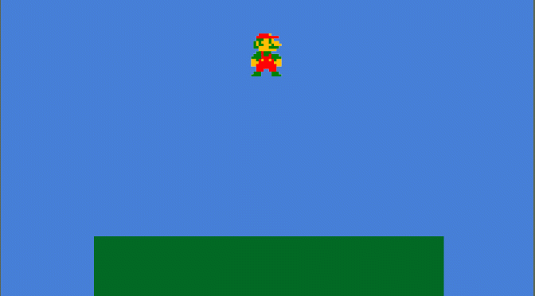

# Week 6-B 2D Character Movement \(Unity\)

In this activity, you'll have a character walk left and right \(using a walk cycle animation\) and jump in Unity.

For information on how to create a new Unity project and what each of the windows/tabs mean, please see [Week 5-D Step 1](../week-5/week-5-d-for-and-foreach-loops-in-unity.md).

## Images



## Step 1: Create and Set Up a New Scene

Open a previous Unity project file or create a new one.


The layout in these examples uses a custom layout so both the Scene and Game windows can be viewed at the same time as well as having the Console visible. You can move the tabs and windows around by clicking and dragging the tabs.


### Create a New Scene

Create a new scene in your Project window/tab by going to the default **Scenes** folder, then right-click and choose Create &gt; Scene.


Name your scene. I named this one "Mario."


Double-click on the new scene. This will open the scene in the Hierarchy, Scene, and Game windows.


The name of the scene will be at the top of the Hierarchy window. A scene will have a Main Camera and Directional Light by default. 

### Switch to 2D

Depending on what you have working on, the Scene window will most likely be in 3D mode by default. You know this is the mode when a directional gizmo exists at the top right.

To change this to 2D, click the **2D** toggle button at the top left of the Scene window.


This will switch the scene to view it straight on from the same angle as the Main Camera:


### Update the Background to a Solid Color

The scene defaults to a "skybox" with a horizon. If you were to continue with a 2D environment, you'd probably create flat images to represent a horizon. For this activity, let's change the background to a sky color - I'm choosing blue.

To change the color, select the Main Camera in the Hierarchy window:


This will bring up all the information and components \(scripts\) attached to it in the Inspector window.


Under _Camera_, for "Clear Flags," select **Solid Color** from the drop-down menu.

For _Background_, it defaults to a dark blue. Change this color by clicking on the color and selecting a color from the color wheel and center color square. Close out of the color window when finished.


This background will appear in the Game window only because that window uses the Main Camera's view.

### Change the Aspect Ratio

In the Game window, switch "Free Aspect" at the top left of the window to 16:9 or whatever you want it to be. Free Aspect will change based on the size of the window.


## Step 2: Add Objects to the Scene

### Add the Ground

Let's start with adding a "Ground" object for Mario to run on.

For 2D projects, we create reusable "sprites" that Unity understands will interact on a single plane.

For "Ground," we can create a square sprite.

In the Project window, go to the **Assets** folder. Right click in the window and create a new folder called **Sprites**.

Go to the new **Sprites** folder and right-click and select Create &gt; Sprites &gt; Square.

 


It creates a square sprite that appears white. You can rename it, but I'm going to leave it as "Square."


Click and drag Square into the Hierarchy window. This will turn it into a game object that references the sprite.

Rename the game object to "Ground."



At this point, if the object is not bright, it might be lit incorrectly. If this is the case, select the Directional Light and use the Transform component's rotation values to get the color and brightness to be correct.


The square will appear in the center of your Game window, but you might have to use your scrolling center mouse button to move things around or hold SHIFT, CTRL, etc. and the right mouse button to line up your view in the Scene window.

Turn Ground green \(or some other ground color\) by selecting Ground in the Hierarchy window and using the Inspector window.

in the Inspector, under _Sprite Renderer_, change the **Color** property just as you did with the background color.


While selected, the sprite will have blue dot vectors you can use to resize the square. You can also click and drag it to move it. Use the Game window to see what the user sees and make the ground be at the bottom of the screen.


Add the Mario sprites.

Download the following file and extract the PNG images:



These are images for standing, jumping, and three walking versions of Mario.

Select all the PNG images and click and drag them all into the Project window.


As you can see, they import as images and the transparent background appear white. We need them to be sprites with transparency.

Click on the first one - jump - to get its information to appear in the Inspector window.


Change Texture Type to **Sprite \(2D and UI\)** and click the **Apply** button.

This brings back the transparent background and adds extra info:


Do this will all the Mario sprites.


We only need one Mario in our scene, so take the default one - stand - and click and drag it into the Hierarchy window.

Rename it to Mario and resize it as you did with the Ground object. Leave it above the ground.

### Add Colliders and a Rigidbody

Colliders calculate the boundaries of an object. You can always adjust these to be different than the visible boundaries.

Click on the Ground object. In the Inspector window, click the **Add Component** button.

Search for **Box Collider 2D**. Click on it and it will add the component:


Add a Box Collider 2D to the Mario object as well. This way the objects will know when they are touching.

Mario needs gravity, now. We can do this by adding a Rigidbody 2D component the same way we added the collider. Select Mario, then in the Inspector window, click the **Add Component** button. Search for **Rigidbody 2D** and click on it to add it. Gravity Scale defaults at 1, meaning it will replicate "normal" gravity.


### Test It

Press play. Mario should fall to the ground.



## Step 3: Script Setup

Now, we want to create the script.

In the Project window, go to the **Assets** folder. In the window, right-click and create a new folder called **Scripts** and go to it.

Create a new script by right-clicking and choosing Create &gt; C\# Script


It will appear like this:


Name it something like MarioMove.


Names are in Pascal casing and no spaces. It must match the class name within the script, so any renaming here needs to also happen within the script.



Double-click it to have it open in your text editor - it should be Visual Studio.

The default script will look like this:

```csharp
using System.Collections;
using System.Collections.Generic;
using UnityEngine;

public class MarioMove : MonoBehaviour
{
    // Start is called before the first frame update
    void Start()
    {
        
    }

    // Update is called once per frame
    void Update()
    {
        
    }
}
```

Let's begin with variables we will need to assign inside the Unity interface:

* Mario character
* 5 images \(stand, jump, and 3 for the walk cycle\)

```csharp
using System.Collections;
using System.Collections.Generic;
using UnityEngine;

public class MarioMove : MonoBehaviour
{
    public GameObject mario;

    public Sprite stand;
    public Sprite walk1;
    public Sprite walk2;
    public Sprite walk3;
    public Sprite jump;

    // Start is called before the first frame update
    void Start()
    {
        
    }

    // Update is called once per frame
    void Update()
    {
        
    }
}
```

We are using a GameObject with the mario character to access multiple aspects of the object and since we are only referencing the sprites for the images, we are using Sprite as the variable/object type for those.

The **public** keyword means the information will be visible and updatable within the Unity interface and functions within this script and other scripts can access those variables.

Save the script and return to Unity.

Select the Mario game object in the Hierarchy window. Click and drag the MarioMove script onto the Mario object within the Hierarchy window OR into the Inspector window in a blank area at the bottom \(near the button\) OR use the **Add Component** button method and search for MarioMove.

When added, it will look like this:


Use the Bull's eye/target icon on the right of the variable or click and drag the items into the proper spaces.

NOTE: The Mario object is dragged from the Hierarchy window and the sprites are dragged from the Project window.


## Step 4: Add Movement

Go back to your script.

We want to use our left and right arrow keyboard keys to move Mario left and right.

In Unity, it can check for multiple key presses at the same time and whether the button is pressed can happen in the Update\(\) function.

In the Update\(\) function, let's check for the right arrow key being pressed by using the **Input** class and the function **GetKey\(\)** which returns true on each frame the button is pressed and false when it's not being pressed. The GetKey\(\) function takes a KeyCode type value to know what key you're looking for. However, who can remember key codes? Unity has a built-in feature where you can access the key code by using KeyCode.Key.

```csharp
void Update()
{
    if (Input.GetKey(KeyCode.RightArrow) == true)
    {

    }
}
```


== true is redundant here since the GetKey\(\) function will be true or false and this is basically asking if true == true. I'm leaving this in this code to make the if statements easier to read if you are new to coding.


To make Mario move right, let's use a function called **Translate\(\).** The term "translate" means "move" in this context.

To use this, we need to access the mario game object's Transform component with dots. The order goes from the largest item to one step smaller or inside to another more detailed aspect.

The **Translate\(\)** function wants to know what direction to move in. You can use a new Vector3\(\) - a variable type that holds x, y, and z coordinates, but I like using shorthand code that does this for me, moving the object in a direction at one unit at a time.

```csharp
void Update()
    {
        if (Input.GetKey(KeyCode.RightArrow) == true)
        {
            mario.transform.Translate(Vector3.right);
        }
    }
```

This will move the object right 1 unit PER FRAME. We want to slow that down so it's roughly 1 unit per second. We do this with **Time.deltaTime.** Multiply Vector3.right by this modifier.

```csharp
void Update()
    {
        if (Input.GetKey(KeyCode.RightArrow) == true)
        {
            mario.transform.Translate(Vector3.right * Time.deltaTime);
        }
    }
```

We also want to be able to adjust the speed, so let's add a public speed variable at the top and multiply this speed modifier to our Translate\(\) direction.

Full code so far:

```csharp
using System.Collections;
using System.Collections.Generic;
using UnityEngine;

public class MarioMove : MonoBehaviour
{
    public GameObject mario;

    public Sprite stand;
    public Sprite walk1;
    public Sprite walk2;
    public Sprite walk3;
    public Sprite jump;

    public float speed = 3;

    // Start is called before the first frame update
    void Start()
    {
        
    }

    // Update is called once per frame
    void Update()
    {
        if (Input.GetKey(KeyCode.RightArrow) == true)
        {
            mario.transform.Translate(Vector3.right * speed * Time.deltaTime);
        }
    }
}
```

Save your script and go back to Unity to test.

Click play and test the right arrow key.


You can change the speed within Unity by updating the MarioMove component in the Inspector window:


Let's get the other direction working.

Go back to the script.

Copy and paste the if statement for the right arrow and update the two places that say "right" to say "left."

```csharp
void Update()
{
    if (Input.GetKey(KeyCode.RightArrow) == true)
    {
        mario.transform.Translate(Vector3.right * speed * Time.deltaTime);
    }

    if (Input.GetKey(KeyCode.LeftArrow) == true)
    {
        mario.transform.Translate(Vector3.left * speed * Time.deltaTime);
    }
}
```

Save your script. Go back to Unity and test it using both arrow keys!


## Step 5: Adding the Walk Cycle

Go back to your script.

The walk cycle will show sprites in order, then reset back to the first one. Each animation frame needs to be slow enough to be visible. To slow these changes, we can use a timer-like variable that counts down, triggers something at zero, then resets.

Let's call this timer variable **delay**. \(In some languages, a function called Delay\(\) is used to do this within the code.\)

We won't set the delay within the variables. Instead, we will create a **delayReset** variable to hold a number that modifies the speed of the countdown.

```csharp
public float delay;
public float delayReset = 1;
```

Set the delay in the Start\(\) function to give it a value when first played:

```csharp
void Start()
{
    delay = delayReset;
}
```

In the Update\(\) function, near the top let's get the delay to do the countdown and reset.

```csharp
void Update()
{
    delay -= 1 * Time.deltaTime;

    if (delay <= 0)
    {


        delay = delayReset;
    }
...
```


Make sure to have the delay = delayReset at the end of the if statement so that it has a chance to always reset even when the code inside does not.


Now, we need to see what animation frame it is on and update the sprite to the next one.

Since the information returned is odd when looking at the sprite itself, lets give an integer number to each walking sprite and use those in our if statements.

In the variables, add a variable **walkingImage** and set it to 1 to have it match our walking variables.

```csharp
public int walkingImage = 1;
```

Then, inside the delay if statement, let's check to see if walkingImage is 1. If it is, we can set the walking image to 1, update the variable walkingImage to 2 \(for the next loop around\) and reset the delay.

```csharp
...

if (delay <= 0)
{
    if (walkingImage == 1)
    {
        // Sets the sprite for mario to walk1
        mario.GetComponent<SpriteRenderer>().sprite = walk1;
        walkingImage = 2;
        delay = delayReset;
    }

    delay = delayReset;
}

...
```

Note about GetComponent&lt;&gt;\(\): 

**GetComponent&lt;&gt;\(\)** is a function that looks for the component or script listed within the angle brackets &lt;&gt; so the variables and functions within can be accessed, such as the **Sprite** variable/parameter of mario's Sprite Renderer component.

Now, copy and paste this walkingImage if statement and update the 1s to 2s and 2 to 3.

Also, change it to an else if.

```csharp
...

if (delay <= 0)
{
    if (walkingImage == 1)
    {
        // Sets the sprite for mario to walk1
        mario.GetComponent<SpriteRenderer>().sprite = walk1;
        walkingImage = 2;
        delay = delayReset;
    }

    else if (walkingImage == 2)
    {
        // Sets the sprite for mario to walk2
        mario.GetComponent<SpriteRenderer>().sprite = walk2;
        walkingImage = 3;
        delay = delayReset;
    }

    delay = delayReset;
}

...
```

Add it again, updating the if statement to else and updating it to set the sprite to walk 3 and the walking image to 1.

```csharp
 ...
 
 delay -= 1 * Time.deltaTime;

if (delay <= 0)
{
    if (walkingImage == 1)
    {
        // Sets the sprite for mario to walk1
        mario.GetComponent<SpriteRenderer>().sprite = walk1;
        walkingImage = 2;
        delay = delayReset;
    }

    else if (walkingImage == 2)
    {
        // Sets the sprite for mario to walk2
        mario.GetComponent<SpriteRenderer>().sprite = walk2;
        walkingImage = 3;
        delay = delayReset;
    }

    else
    {
        // Sets the sprite for mario to walk3
        mario.GetComponent<SpriteRenderer>().sprite = walk3;
        walkingImage = 1;
        delay = delayReset;
    }

    delay = delayReset;
}

...
```

Now we need to say when mario is walking and when he isn't. Let's put it in a boolean variable called **isWalking**.

```csharp
public bool isWalking = false;
```

We want Mario to walk ONLY when moving and thus, only when the arrow keys are being used. Let's update the arrow key if statements to update isWalking to true.

```csharp
...

if (Input.GetKey(KeyCode.RightArrow) == true)
{
    mario.transform.Translate(Vector3.right * speed * Time.deltaTime);
    isWalking = true;
}

if (Input.GetKey(KeyCode.LeftArrow) == true)
{
    mario.transform.Translate(Vector3.left * speed * Time.deltaTime);
    isWalking = true;
}

...
```

We turn on walking, so we need to turn it off.

Add an if statement looking to see if both left and right arrows are NOT being pressed. Then, when that is true, we can turn off walking and make sure Mario is standing.

```csharp
if (Input.GetKey(KeyCode.RightArrow) != true && 
    Input.GetKey(KeyCode.LeftArrow) != true)
{
    // Sets the sprite for mario to stand
    mario.GetComponent<SpriteRenderer>().sprite = stand;
    isWalking = false;
}
```

We want the walk cycle to run only when Mario is walking, so let's wrap the code in an if statement looking to see if Mario is walking.

```csharp
...

delay -= 1 * Time.deltaTime;

if (delay <= 0)
{
    if (isWalking == true)
    {
        if (walkingImage == 1)
        {
            // Sets the sprite for mario to walk1
            mario.GetComponent<SpriteRenderer>().sprite = walk1;
            walkingImage = 2;
            delay = delayReset;
        }

        else if (walkingImage == 2)
        {
            // Sets the sprite for mario to walk2
            mario.GetComponent<SpriteRenderer>().sprite = walk2;
            walkingImage = 3;
            delay = delayReset;
        }

        else
        {
            // Sets the sprite for mario to walk3
            mario.GetComponent<SpriteRenderer>().sprite = walk3;
            walkingImage = 1;
            delay = delayReset;
        }
    }

    delay = delayReset;
}

...
```

WOW. That's a lot of code!

Let's separate it out into its own custom function.

At the end of the code, before the final ending curly bracket }, we will create a function called **Walk\(\)** that takes no input/arguments \(because the variables are all public\) and provides no values.

```csharp
...

public void Walk()
{

}

...
```

Move the walk cycle code to the inside of the curly brackets { }

```csharp
...

public void Walk()
{
    if (walkingImage == 1)
    {
        // Sets the sprite for mario to walk1
        mario.GetComponent<SpriteRenderer>().sprite = walk1;
        walkingImage = 2;
        delay = delayReset;
    }

    else if (walkingImage == 2)
    {
        // Sets the sprite for mario to walk2
        mario.GetComponent<SpriteRenderer>().sprite = walk2;
        walkingImage = 3;
        delay = delayReset;
    }

    else
    {
        // Sets the sprite for mario to walk3
        mario.GetComponent<SpriteRenderer>().sprite = walk3;
        walkingImage = 1;
        delay = delayReset;
    }
}

...
```

Then in the delay/isWalking if statement, just call the function:

```csharp
...

delay -= 1 * Time.deltaTime;

if (delay <= 0)
{
    if (isWalking == true)
    {
        Walk();
    }

    delay = delayReset;
}

...
```

Save your script and test it.


Woah. So slow. So let's make the delayReset smaller within the Unity interface using the MarioMove component.


Result of 0.1 for Delay Reset:


## Step 6: Change the Direction Mario is Facing

**Hot Tip:** You don't have to create a separate sprite set for the other direction. For 2D objects like sprites, negative **scale** values will flip the image. You can easily change a positive number to its negative by multiplying by -1 and it also flips it back. Pretty nifty, right?

Let's make a variable called **direction** to keep track of the direction.

```csharp
public int direction = 0;       // 0 = right 1 = left
```

Let's create a function to check which direction Mario is facing and if it's not the right direction, to update it.

Before the final curly bracket }, create a function called **FaceDirection\(\)** that doesn't need input/arguments \(because the variables are public\) and has no output/return value.

```csharp
public void FaceDirection()
{
    // if the x scale is negative, it's facing left
    if (mario.transform.localScale.x < 0)
    {
        if (direction == 0)     // if Mario should be facing right, update it
        {
            // set a new scale using the current values and multiplying x by -1 to turn it positive
            mario.transform.localScale = new Vector3(mario.transform.localScale.x * -1, mario.transform.localScale.y, mario.transform.localScale.z);
        }
    }

    // if the x scale is positive, it's facing right
    if (mario.transform.localScale.x > 0)
    {
        if (direction == 1)     // if Mario should be facing left, update it
        {
            // set a new scale using the current values and multiplying x by -1 to turn it negative
            mario.transform.localScale = new Vector3(mario.transform.localScale.x * -1, mario.transform.localScale.y, mario.transform.localScale.z);
        }
    }
}
```

Notice the only difference between these two if statements is whether the x local scale is greater than or lesser than 0 and the current direction. So copying and pasting makes it easier than typing.

We want to call FaceDirection\(\) when the right or left arrow is pressed, so let's add that and update the direction variables there.

```csharp
...

if (Input.GetKey(KeyCode.RightArrow) == true)
{
    mario.transform.Translate(Vector3.right * speed * Time.deltaTime);
    isWalking = true;
    direction = 0;
    FaceDirection();
}

if (Input.GetKey(KeyCode.LeftArrow) == true)
{
    mario.transform.Translate(Vector3.left * speed * Time.deltaTime);
    isWalking = true;
    direction = 1;
    FaceDirection();
}

...
```

To catch up, here's the full code so far:

```csharp
using System.Collections;
using System.Collections.Generic;
using UnityEngine;

public class MarioMove : MonoBehaviour
{
    public GameObject mario;

    public Sprite stand;
    public Sprite walk1;
    public Sprite walk2;
    public Sprite walk3;
    public Sprite jump;

    public float speed = 3;

    public float delay;
    public float delayReset = 1;

    public int walkingImage = 1;

    public bool isWalking = false;

    public int direction = 0;       // 0 = right 1 = left

    // Start is called before the first frame update
    void Start()
    {
        delay = delayReset;
    }

    // Update is called once per frame
    void Update()
    {
        delay -= 1 * Time.deltaTime;

        if (delay <= 0)
        {
            if (isWalking == true)
            {
                Walk();
            }

            delay = delayReset;
        }

        if (Input.GetKey(KeyCode.RightArrow) == true)
        {
            mario.transform.Translate(Vector3.right * speed * Time.deltaTime);
            isWalking = true;
            direction = 0;
            FaceDirection();
        }

        if (Input.GetKey(KeyCode.LeftArrow) == true)
        {
            mario.transform.Translate(Vector3.left * speed * Time.deltaTime);
            isWalking = true;
            direction = 1;
            FaceDirection();
        }

        if (Input.GetKey(KeyCode.RightArrow) != true && Input.GetKey(KeyCode.LeftArrow) != true)
        {
            // Sets the sprite for mario to stand
            mario.GetComponent<SpriteRenderer>().sprite = stand;
            isWalking = false;
        }
    }

    public void Walk()
    {
        if (walkingImage == 1)
        {
            // Sets the sprite for mario to walk1
            mario.GetComponent<SpriteRenderer>().sprite = walk1;
            walkingImage = 2;
            delay = delayReset;
        }

        else if (walkingImage == 2)
        {
            // Sets the sprite for mario to walk2
            mario.GetComponent<SpriteRenderer>().sprite = walk2;
            walkingImage = 3;
            delay = delayReset;
        }

        else
        {
            // Sets the sprite for mario to walk3
            mario.GetComponent<SpriteRenderer>().sprite = walk3;
            walkingImage = 1;
            delay = delayReset;
        }
    }

    public void FaceDirection()
    {
        // if the x scale is negative, it's facing left
        if (mario.transform.localScale.x < 0)
        {
            if (direction == 0)     // if Mario should be facing right, update it
            {
                // set a new scale using the current values and multiplying x by -1 to turn it positive
                mario.transform.localScale = new Vector3(mario.transform.localScale.x * -1, mario.transform.localScale.y, mario.transform.localScale.z);
            }
        }

        // if the x scale is positive, it's facing right
        if (mario.transform.localScale.x > 0)
        {
            if (direction == 1)     // if Mario should be facing left, update it
            {
                // set a new scale using the current values and multiplying x by -1 to turn it negative
                mario.transform.localScale = new Vector3(mario.transform.localScale.x * -1, mario.transform.localScale.y, mario.transform.localScale.z);
            }
        }
    }
}

```

Save your script and test it out!


## Step 7: Jumping

Let's make it jump with the spacebar!

Using the if statement and Input class, let's add this interaction to Update\(\).

This time, we only want the jump to fire the frame we press the button, so we use **GetKeyDown\(\)** instead of **GetKey\(\)**.

```csharp
...

if (Input.GetKeyDown(KeyCode.Space) == true)
{

}

...
```

Let's add some control variable for the jumping like **jumpHeight** and **isJumping**.

```csharp
public bool isJumping = false;
public float jumpHeight = 500;
```

The **Rigidbody 2D** component we added for gravity has some nifty built-in functions like **AddForce\(\)**. We just access the Rigidbody 2D component and give AddForce\(\) a direction like Vector2.up and it will push the object upward.

```csharp
...

if (Input.GetKeyDown(KeyCode.Space) == true)
{
    mario.GetComponent<Rigidbody2D>().AddForce(Vector2.up);
}

...
```

Just like the Vector3.right and Vector3.left, Vector2.up only goes up 1 unit. Let's multiply it by the jumpHeight variable.

```csharp
...

if (Input.GetKeyDown(KeyCode.Space) == true)
{
    mario.GetComponent<Rigidbody2D>().AddForce(Vector2.up * jumpHeight);
}

...
```

Save your script and test it in Unity.


So it looks like we can "double jump" or jump while in the air. We don't want that. We want the jump button to disable when jumping.

We also want to make him have a jump sprite when in the sky.

Let's wrap the AddForce\(\) line with an if statement seeing if he's jumping and update it that he is.

```csharp
...

if (Input.GetKeyDown(KeyCode.Space) == true)
{
    if (isJumping != true)
    {
        mario.GetComponent<Rigidbody2D>().AddForce(Vector2.up * jumpHeight);
        isJumping = true;
    }
}
...
```

While Mario is jumping, he should have a jump sprite.

Add this to Update\(\) so it checks every frame if he's jumping:

```csharp
...

if (isJumping == true)
{
    mario.GetComponent<SpriteRenderer>().sprite = jump;
}

...
```

So it doesn't get confused with walking add a check for not jumping to the delay/isWalking test.

```csharp
...

delay -= 1 * Time.deltaTime;

if (delay <= 0)
{
    if (isWalking == true && isJumping != true)
    {
        Walk();
    }

    delay = delayReset;
}

...
```

We also need to add to the test for the code that sets Mario to stand.

```csharp
...

if (Input.GetKey(KeyCode.RightArrow) != true && 
    Input.GetKey(KeyCode.LeftArrow) != true && 
    isJumping != true)
{
    // Sets the sprite for mario to stand
    mario.GetComponent<SpriteRenderer>().sprite = stand;
    isWalking = false;
}

...
```

Save your code and test it in Unity.

The jump works better, but only once. It's because we don't have isJumping turning off at all.

For this activity, we want jumping to turn off when Mario touches the Ground object. That's where collision comes in.

Unity has a built-in function that works with the collider and rigidbody to detect things the object the script is attached to touches.

Let's use **OnColldierEnter2D\(\)** to detect when Mario hits the ground.

Put this before the final curly bracket }:

```csharp
public void OnCollisionEnter2D(Collision2D collision)
{
    
}
```

The argument variable **collision** holds information about the object being touched. Let's turn off jumping if the object matches the name of our Ground object.

```csharp
public void OnCollisionEnter2D(Collision2D collision)
{
    if (collision.gameObject.name == "Ground")
    {
        isJumping = false;
    }
}
```

Save your script and test it! It should work now.


## Full Code

```csharp
using System.Collections;
using System.Collections.Generic;
using UnityEngine;

public class MarioMove : MonoBehaviour
{
    public GameObject mario;

    public Sprite stand;
    public Sprite walk1;
    public Sprite walk2;
    public Sprite walk3;
    public Sprite jump;

    public float speed = 3;

    public float delay;
    public float delayReset = 1;

    public int walkingImage = 1;

    public bool isWalking = false;

    public int direction = 0;       // 0 = right 1 = left

    public bool isJumping = false;
    public float jumpHeight = 500;

    // Start is called before the first frame update
    void Start()
    {
        delay = delayReset;
    }

    // Update is called once per frame
    void Update()
    {
        delay -= 1 * Time.deltaTime;

        if (delay <= 0)
        {
            if (isWalking == true && isJumping != true)
            {
                Walk();
            }

            delay = delayReset;
        }

        if (isJumping == true)
        {
            mario.GetComponent<SpriteRenderer>().sprite = jump;
        }

        if (Input.GetKey(KeyCode.RightArrow) == true)
        {
            mario.transform.Translate(Vector3.right * speed * Time.deltaTime);
            isWalking = true;
            direction = 0;
            FaceDirection();
        }

        if (Input.GetKey(KeyCode.LeftArrow) == true)
        {
            mario.transform.Translate(Vector3.left * speed * Time.deltaTime);
            isWalking = true;
            direction = 1;
            FaceDirection();
        }

        if (Input.GetKey(KeyCode.RightArrow) != true && Input.GetKey(KeyCode.LeftArrow) != true && isJumping != true)
        {
            // Sets the sprite for mario to stand
            mario.GetComponent<SpriteRenderer>().sprite = stand;
            isWalking = false;
        }

        if (Input.GetKeyDown(KeyCode.Space) == true)
        {
            if (isJumping != true)
            {
                mario.GetComponent<Rigidbody2D>().AddForce(Vector2.up * jumpHeight);
                isJumping = true;
            }
        }
    }

    public void Walk()
    {
        if (walkingImage == 1)
        {
            // Sets the sprite for mario to walk1
            mario.GetComponent<SpriteRenderer>().sprite = walk1;
            walkingImage = 2;
            delay = delayReset;
        }

        else if (walkingImage == 2)
        {
            // Sets the sprite for mario to walk2
            mario.GetComponent<SpriteRenderer>().sprite = walk2;
            walkingImage = 3;
            delay = delayReset;
        }

        else
        {
            // Sets the sprite for mario to walk3
            mario.GetComponent<SpriteRenderer>().sprite = walk3;
            walkingImage = 1;
            delay = delayReset;
        }
    }

    public void FaceDirection()
    {
        // if the x scale is negative, it's facing left
        if (mario.transform.localScale.x < 0)
        {
            if (direction == 0)     // if Mario should be facing right, update it
            {
                // set a new scale using the current values and multiplying x by -1 to turn it positive
                mario.transform.localScale = new Vector3(mario.transform.localScale.x * -1, mario.transform.localScale.y, mario.transform.localScale.z);
            }
        }

        // if the x scale is positive, it's facing right
        if (mario.transform.localScale.x > 0)
        {
            if (direction == 1)     // if Mario should be facing left, update it
            {
                // set a new scale using the current values and multiplying x by -1 to turn it negative
                mario.transform.localScale = new Vector3(mario.transform.localScale.x * -1, mario.transform.localScale.y, mario.transform.localScale.z);
            }
        }
    }

    public void OnCollisionEnter2D(Collision2D collision)
    {
        if (collision.gameObject.name == "Ground")
        {
            isJumping = false;
        }
    }
}

```

