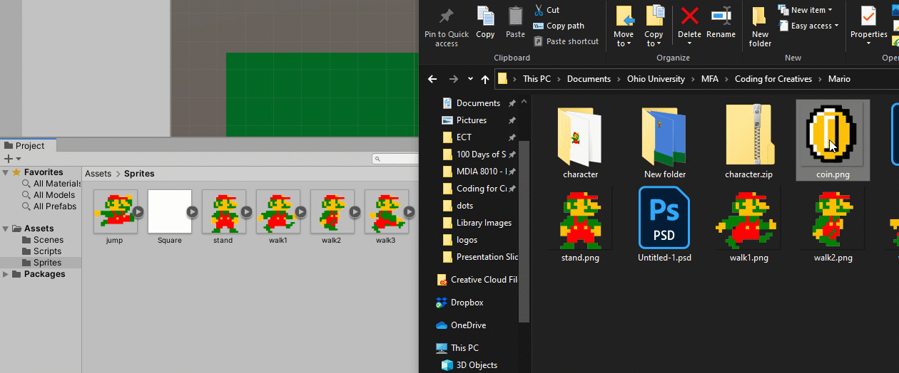
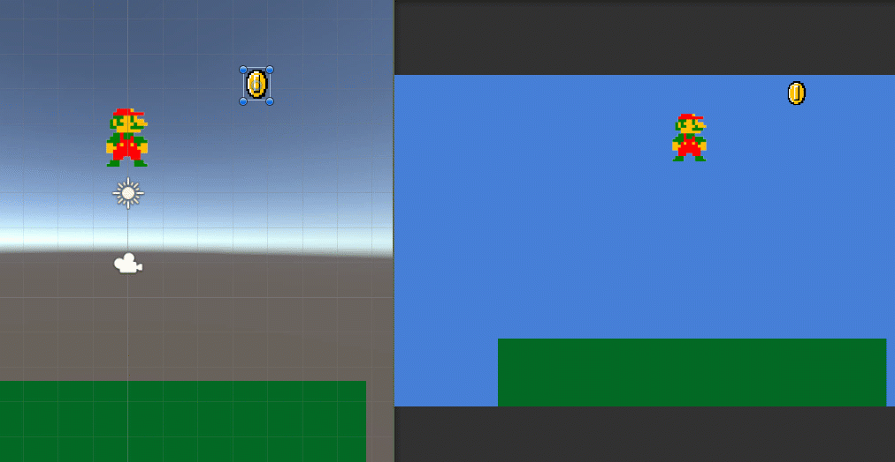
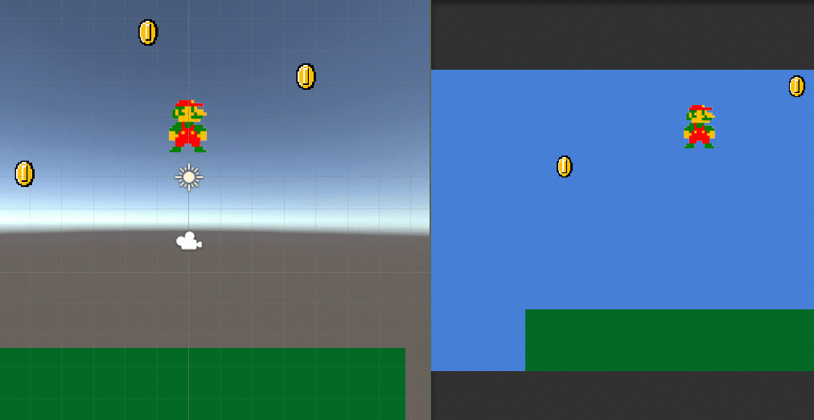
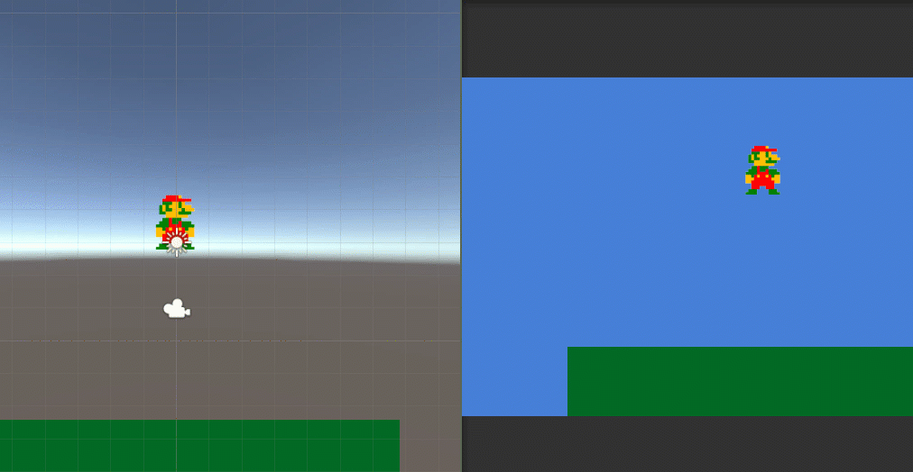

# Week 7-A Mario Coin Catch (Unity)

This starts off after we add the jump code. Please start from the end of Week 6-B's activity. This activity uses Unity and all code should allow you to copy and paste.

For information on how to create a new Unity project and what each of the windows/tabs mean, please see [Week 5-D Step 1](../week-5/week-5-d-for-and-foreach-loops-in-unity.md).


Be sure to download Visual Studio to make it easier to code in C# for Unity. Download it here: \
[https://visualstudio.microsoft.com/vs/community/](https://visualstudio.microsoft.com/vs/community/)


## Images


MarioImages.zip


## Start with this Code


This code is for a MarioMove.cs script within the Assets folder in Unity. If you create it by scratch, you will need to add this script to your Mario game object and assign your sprites and Mario game object within your Mario Move component (inside the Inspector Tab).

Individual values might need to be updated to fit your tastes. It should appear something like this:


.png>)

```csharp
using System.Collections;
using System.Collections.Generic;
using UnityEngine;

public class MarioMove : MonoBehaviour
{
    public GameObject mario;

    public Sprite stand;
    public Sprite walk1;
    public Sprite walk2;
    public Sprite walk3;
    public Sprite jump;

    public float speed = 3;

    public float delay;
    public float delayReset = 1;

    public int walkingImage = 1;

    public bool isWalking = false;

    public int direction = 0;       // 0 = right 1 = left

    public bool isJumping = false;
    public float jumpHeight = 500;

    // Start is called before the first frame update
    void Start()
    {
        delay = delayReset;
    }

    // Update is called once per frame
    void Update()
    {
        delay -= 1 * Time.deltaTime;

        if (delay <= 0)
        {
            if (isWalking == true && isJumping != true)
            {
                Walk();
            }

            delay = delayReset;
        }

        if (isJumping == true)
        {
            mario.GetComponent<SpriteRenderer>().sprite = jump;
        }

        if (Input.GetKey(KeyCode.RightArrow) == true)
        {
            mario.transform.Translate(Vector3.right * speed * Time.deltaTime);
            isWalking = true;
            direction = 0;
            FaceDirection();
        }

        if (Input.GetKey(KeyCode.LeftArrow) == true)
        {
            mario.transform.Translate(Vector3.left * speed * Time.deltaTime);
            isWalking = true;
            direction = 1;
            FaceDirection();
        }

        if (Input.GetKey(KeyCode.RightArrow) != true && Input.GetKey(KeyCode.LeftArrow) != true && isJumping != true)
        {
            // Sets the sprite for mario to stand
            mario.GetComponent<SpriteRenderer>().sprite = stand;
            isWalking = false;
        }

        if (Input.GetKeyDown(KeyCode.Space) == true)
        {
            if (isJumping != true)
            {
                mario.GetComponent<Rigidbody2D>().AddForce(Vector2.up * jumpHeight);
                isJumping = true;
            }
        }
    }

    public void Walk()
    {
        if (walkingImage == 1)
        {
            // Sets the sprite for mario to walk1
            mario.GetComponent<SpriteRenderer>().sprite = walk1;
            walkingImage = 2;
            delay = delayReset;
        }

        else if (walkingImage == 2)
        {
            // Sets the sprite for mario to walk2
            mario.GetComponent<SpriteRenderer>().sprite = walk2;
            walkingImage = 3;
            delay = delayReset;
        }

        else
        {
            // Sets the sprite for mario to walk3
            mario.GetComponent<SpriteRenderer>().sprite = walk3;
            walkingImage = 1;
            delay = delayReset;
        }
    }

    public void FaceDirection()
    {
        // if the x scale is negative, it's facing left
        if (mario.transform.localScale.x < 0)
        {
            if (direction == 0)     // if Mario should be facing right, update it
            {
                // set a new scale using the current values and multiplying x by -1 to turn it positive
                mario.transform.localScale = new Vector3(mario.transform.localScale.x * -1, mario.transform.localScale.y, mario.transform.localScale.z);
            }
        }

        // if the x scale is positive, it's facing right
        if (mario.transform.localScale.x > 0)
        {
            if (direction == 1)     // if Mario should be facing left, update it
            {
                // set a new scale using the current values and multiplying x by -1 to turn it negative
                mario.transform.localScale = new Vector3(mario.transform.localScale.x * -1, mario.transform.localScale.y, mario.transform.localScale.z);
            }
        }
    }

    public void OnCollisionEnter2D(Collision2D collision)
    {
        if (collision.gameObject.name == "Ground")
        {
            isJumping = false;
        }
    }
}

```

## One more thing to add before starting

Click on your Mario object to bring up its components in the **Inspector** window. 

Under **Rigidbody 2D**, twirl down _Constraints_ and check **Freeze Rotation** > Z. Otherwise, Mario will fall over from the force.

## Step 1: Import Your Coin Sprite

Feel free to use this image or import in another image to serve as your "coin."


Coin.png


Click and drag it from your computer's folder into the Assets folder within your Project Window in Unity.



You'll notice it has a white background because it's just an image right now.

Let's change it to a sprite.

Click on the coin image. In the Inspector Window, change the **Texture Type **to **Sprite (2D and UI)**.

.png>)

Click the **Apply** button.

This should turn the image into a sprite with a transparent background.

.png>)

## Step 2: Create a Coin Prefab

### 2a. Add example coin to scene

To create a prefab (a reusable object), we need to make an example of that object.

Drag the coin sprite into your scene and resize it to your liking.

.png>)

### 2b. Create the spinning coin code

The coins will use their own code to move and communicate to a centralized object.

In the Project window, go to the **Assets** folder. In the window, right-click and create a new folder called **Scripts** and go to it.

Create a new script by right-clicking and choosing Create > C# Script

.png>)

It will appear like this:

.png>)

Name it something like CoinBehavior.

Click and drag it or use the **Add Component** button in the Inspector Window to add the CoinBehavior script component to the coin object in the scene.

It should appear like this in the inspector.

.png>)

Open it in your text editor (preferably Visual Studio).

Here, we want the coin to spin.

Since the code will only be used on the coin, we can access the transform component simply by using "transform." The script will look for a transform component within the object it is attached to.

In Update(), add the following code:

```csharp
transform.Rotate(Vector3.up);
```

Rotate() is a built-in function inside the transform **class** - the set of code that controls and stores information for transform components.

Vector3.up is shorthand for new Vector3(0, 1, 0), so the coin will spin on the Y axis.

Modify this with Time.deltaTime to normalize the speed.

```csharp
transform.Rotate(Vector3.up * Time.deltaTime);
```

To adjust this speed, add a variable at the top for speed and multiply it to the Rotate() argument.

```csharp
using System.Collections;
using System.Collections.Generic;
using UnityEngine;

public class CoinBehavior : MonoBehaviour
{
    public float spinSpeed = 100;

    // Start is called before the first frame update
    void Start()
    {
        
    }

    // Update is called once per frame
    void Update()
    {
        transform.Rotate(Vector3.up * Time.deltaTime * spinSpeed);
    }
}
```

Save and test!


### 2c. Have the coin fall

We want the coins to fall at the same rate, so we should store the fall speed in a separate, centralized object with a script.

I generally call this centralized object and script **GameController**. You can name it what you want as long as it matches the references in the code.

Right-click in the **Hierarchy** window and choose **Create Empty**.

.png>)

Rename the new, empty object:

.png>)

In the **Project **window, right-click and create a new **C# Script**.

.png>)

Name it. **REMEMBER:** no spaces and capitalize it!

.png>)

Add the script to the **Game Controller** object.

.png>)

Open the new script.

Add a public variable at the top (above Start()) to store the fall speed:

```csharp
public float fallSpeed = 1;
```

Save the file.

Go to or open the CoinBehavior script.

Add a variable to access the Game Controller and a variable to hold the fall speed info.

```csharp
public GameObject gameController;
public float coinFallSpeed;
```

Set coinFallSpeed to be the GameController script's fallSpeed value in Start().

```csharp
coinFallSpeed = gameController.GetComponent<GameController>().fallSpeed;
```

Also, add this code to Update() so it updates every frame.

Add the code to have the coin move downward continually in the Update() function:

```csharp
transform.position += Vector3.down;
```

Add the Time.deltaTime modifier:

```csharp
transform.position += Vector3.down * Time.deltaTime;
```

Multiply it by the coinFallSpeed.

```csharp
transform.position += Vector3.down * Time.deltaTime * coinFallSpeed;
```

Full code so far:

```csharp
using System.Collections;
using System.Collections.Generic;
using UnityEngine;

public class CoinBehavior : MonoBehaviour
{
    public float spinSpeed = 100;

    public GameObject gameController;
    public float coinFallSpeed;

    // Start is called before the first frame update
    void Start()
    {
        coinFallSpeed = gameController.GetComponent<GameController>().fallSpeed;
    }

    // Update is called once per frame
    void Update()
    {
        // Set fall speed
        coinFallSpeed = gameController.GetComponent<GameController>().fallSpeed;

        // Spin on Y axis
        transform.Rotate(Vector3.up * Time.deltaTime * spinSpeed);

        // Fall downward
        transform.position += Vector3.down * Time.deltaTime * coinFallSpeed;
    }
}
```

Go back to Unity.

Click on the coin object in the Hierarchy or Scene window to bring up its components in the Inspector window.

Use the target icon or click and drag the Game Controller object to the field for Game Controller.

.png>)

Press play to test!



### 2d. Create the Prefab

Create a Prefab folder in your Assets folder within the Project folder. (This is an optional step that helps with organization.)

Click and drag your coin object from the **Hierarchy** window to the **Project** window into your new Prefabs folder.

It will look like this in the **Project **window:

.png>)

And it will appear blue within the **Hierarchy** window:

.png>)

To test, click and drag the prefab from the **Project** window to the **Scene** window. 

Click on one of them - you'll see that Game Controller is **not assigned**. That is because this prefab is available for other scenes where the Game Controller in this scene doesn't exist.

So let's have the coin find and assign the available Game Controller to itself:

Open the CoinBehavior script.

We know the Game Controller in the scene will be the only object with the Game Controller script. We can get the Game Controller object by finding the script first.

In the **Start()** function, set the gameController variable with this script:

```csharp
gameController = FindObjectOfType<GameController>().gameObject;
```

FindObjectOfType<>() is a built-in function that looks for the first object with the component listed in the angle brackets <>. After we get that, we can get the proper part of the object (here, it is the GameObject) we need.

Save and return to Unity. Hit play to test.

The Game Controller field should update and the coins should fall at the same rate. You can change the Fall Speed in Game Controller to see if all coins are affected.



## Step 3: Spawning Coins

Let's use this coin prefab to "spawn" or "instantiate" at a random location within the left and right edges of the frame, but just outside the top of the frame.

Unity has a built-in function called Instantiate() that takes the arguments for the object to spawn and a Vector 3 for where to spawn it.

Open the GameController script.

Since multiple coins will spawn, we will have the Game Controller do the work.

We first need variables for:

* The coin prefab (a game object)
* A spawn delay
* A spawn delay reset value (speed of spawning)

```csharp
public GameObject coinPrefab;
public float spawnDelay;
public float spawnDelayReset = 2;
```

Set spawnDelay in **Start()**

```csharp
void Start()
{
    spawnDelay = spawnDelayReset;
}
```

Since we have a delay, we want to have it countdown and trigger the spawn when it hits zero and then reset.

It loops, so put it in **Update()**.

```csharp
void Update()
{
    // Counts down spawnDelay by 1 * Time.deltatime
    spawnDelay -= Time.deltaTime;

    // When spawnDelay hits zero, run code and restart
    if (spawnDelay <= 0)
    {
        // Insert spawn code here

        // Reset spawnDelay
        spawnDelay = spawnDelayReset;
    }
}
```

Let's use Instantiate() and our coin prefab to spawn the coins.

```csharp
// Spawns coin prefab
Instantiate(coinPrefab);
```

This spawns the coin prefab at the place our example one was.

To be safe, let's update the position of our prefab.

Save your script and return to Unity.

Remove all but one of your coins.

Click on the arrow to the right of the name of the coin object in your **Hierarchy** window.

This opens the coin prefab in your **Scene** window. Any updates in this mode will affect all your instances of that prefab object.

.png>)

While coin is selected, right-click on the Transform component in the **Inspector **window and choose "Reset Position."

.png>)

This might move the coin out of the Scene window. Click on the coin object in Hierarchy and press the letter F to focus on it.

Click the left arrow to the left of the name of the prefab to return to the scene or double-click on the scene in the Project window.

Select the Game Controller object in the **Hierarchy** window to bring up its components in the Inspector window.

Click and drag your coin prefab from the **Project** window to the field for Coin Prefab in the Game Controller script.

.png>)

Test it by playing it!

The coins should spawn at the center of the scene.

Now, let's add the extra positioning.

Click and drag your coin object in the Scene window, looking at the Transform component noting the Y coordinate when it's just out of frame in the **Game **window. Also, note the farthest left and right X coordinates you want.

For mine, it's 8 for the Y axis and and -8.5 (farthest left) and 8.5 (farthest right).

Open the GameController script.

Add another argument for the location for the coin to spawn. For the **x-axis**, I'm using the built-in random function to pick a number between -8.5 and 8.5 and setting the **Y-axis** to 8. The **Z-axis** is 0 because we are working in 2 dimensions.

This version of Instantiate() also needs a rotation, so we'll just use the rotation the prefab already has.

```csharp
// Spawns coin prefab
Instantiate(coinPrefab, new Vector3(Random.Range(-8.5F, 8.5F), 8, 0), coinPrefab.transform.rotation);
```

Full code so far for GameController.cs:

```csharp
using System.Collections;
using System.Collections.Generic;
using UnityEngine;

public class GameController : MonoBehaviour
{
    public float fallSpeed = 1;

    public GameObject coinPrefab;
    public float spawnDelay;
    public float spawnDelayReset = 2;

    // Start is called before the first frame update
    void Start()
    {
        spawnDelay = spawnDelayReset;
    }

    // Update is called once per frame
    void Update()
    {
        // Counts down spawnDelay by 1 * Time.deltatime
        spawnDelay -= Time.deltaTime;

        // When spawnDelay hits zero, run code and restart
        if (spawnDelay <= 0)
        {
            // Spawns coin prefab
            Instantiate(coinPrefab, new Vector3(Random.Range(-8.5F, 8.5F), 8, 0), coinPrefab.transform.rotation);

            // Reset spawnDelay
            spawnDelay = spawnDelayReset;
        }
    }
}
```

Save your script and return to Unity.

Remove the final coin object from your **Hierarchy **window.

Press play to test.

The coins should spawn randomly outside of the frame and fall slowly down.



## Step 4: Collisions

Now, we want to have points and speed increase when Mario hits a coin.

We need to first give our coin prefab a collider.

Click on your coin prefab in the **Project **window to bring up its components in the **Inspector **window.

Click the **Add Component** button and use the search bar to find **Box Collider 2D** component. Select it to add it.

.png>)

Since we are looking at what the coin is hitting, we need to also add a Rigidbody2D component the same way we did the collider.

.png>)

We don't want gravity, so set **Gravity Scale** to zero.

.png>)

Now, open the CoinBehavior script.

At the bottom before the final ending curly bracket } let's add the built-in function that collects information about the item the object hits.

```csharp
public void OnCollisionEnter2D(Collision2D collision)
{
    
}
```

We want it to affect values like scores and fails for the scene, so we need more information in the GameContoller script.

So open up the GameController script.

We need variables for:

* Keeping track of when the game is playing
* Score
* Fails

```csharp
public bool gameOver = false;
public int score = 0;
public int fails = 0;
```

We only want the coins to spawn when the game is running so wrap the Instantiate() code in an if statement:

```csharp
if (gameOver != true)
{
    // Spawns coin prefab
    Instantiate(coinPrefab, new Vector3(Random.Range(-8.5F, 8.5F), 8, 0), coinPrefab.transform.rotation);
}
```

Put in a situation where the game ends.

```csharp
if (fails >= 3)
{
    gameOver = true;
}
```

Full code of GameController so far:

```csharp
using System.Collections;
using System.Collections.Generic;
using UnityEngine;

public class GameController : MonoBehaviour
{
    public float fallSpeed = 1;

    public GameObject coinPrefab;
    public float spawnDelay;
    public float spawnDelayReset = 2;

    public bool gameOver = false;
    public int score = 0;
    public int fails = 0;

    // Start is called before the first frame update
    void Start()
    {
        spawnDelay = spawnDelayReset;
    }

    // Update is called once per frame
    void Update()
    {
        // Counts down spawnDelay by 1 * Time.deltatime
        spawnDelay -= Time.deltaTime;

        // When spawnDelay hits zero, run code and restart
        if (spawnDelay <= 0)
        {
            if (gameOver != true)
            {
                // Spawns coin prefab
                Instantiate(coinPrefab, new Vector3(Random.Range(-8.5F, 8.5F), 8, 0), coinPrefab.transform.rotation);
            }

            // Reset spawnDelay
            spawnDelay = spawnDelayReset;
        }

        if (fails >= 3)
        {
            gameOver = true;
        }
    }
}
```

Go back to your CoinBehavior script.

Let's increase the score and speed when a coin hits Mario and increase the fails and speed when the coin hits the ground.

```csharp
public void OnCollisionEnter2D(Collision2D collision)
{
    if (collision.gameObject.name == "Mario")
    {
        // Gets the score in the Game Controller script and adds 1
        gameController.GetComponent<GameController>().score += 1;

        // Gets the fallSpeed in the Game Controller and adds 1
        gameController.GetComponent<GameController>().fallSpeed += 1;
    }

    if (collision.gameObject.name == "Ground")
    {
        // Gets the fails in the Game Controller script and adds 1
        gameController.GetComponent<GameController>().fails += 1;

        // Gets the fallSpeed in the Game Controller and adds 1
        gameController.GetComponent<GameController>().fallSpeed += 1;
    }
}
```

**collision** serves as an object of "Collision2D" type that stores information about the object being hit. If the name of the object matches the name of the Mario or Ground object, we can run code.

Once the coin hits anything, let's have it destroy itself with the built-in function **Destroy() **at the end of the OnCollisionEnter2D() function.

```csharp
Destroy(gameObject);
```

CoinBehavior script so far:

```csharp
using System.Collections;
using System.Collections.Generic;
using UnityEngine;

public class CoinBehavior : MonoBehaviour
{
    public float spinSpeed = 100;

    public GameObject gameController;
    public float coinFallSpeed;

    // Start is called before the first frame update
    void Start()
    {
        gameController = FindObjectOfType<GameController>().gameObject;

        coinFallSpeed = gameController.GetComponent<GameController>().fallSpeed;
    }

    // Update is called once per frame
    void Update()
    {
        // Set fall speed
        coinFallSpeed = gameController.GetComponent<GameController>().fallSpeed;

        // Spin on Y axis
        transform.Rotate(Vector3.up * Time.deltaTime * spinSpeed);

        // Fall downward
        transform.position += Vector3.down * Time.deltaTime * coinFallSpeed;
    }

    public void OnCollisionEnter2D(Collision2D collision)
    {
        if (collision.gameObject.name == "Mario")
        {
            // Gets the score in the Game Controller script and adds 1
            gameController.GetComponent<GameController>().score += 1;

            // Gets the fallSpeed in the Game Controller and adds 1
            gameController.GetComponent<GameController>().fallSpeed += 1;
        }

        if (collision.gameObject.name == "Ground")
        {
            // Gets the fails in the Game Controller script and adds 1
            gameController.GetComponent<GameController>().fails += 1;

            // Gets the fallSpeed in the Game Controller and adds 1
            gameController.GetComponent<GameController>().fallSpeed += 1;
        }
        
        Destroy(gameObject);
    }
}

```

Save and test your game in Unity!

We don't have an interface for the score in our game, so for now, you can see the score and fails by selecting the Game Controller object and watching the values change as you play.


## Final Codes

### GameController.cs script

* Attached to Game Controller object


Set the Coin Prefab variable to the coin prefab from the **Project **window.


```csharp
using System.Collections;
using System.Collections.Generic;
using UnityEngine;

public class GameController : MonoBehaviour
{
    public float fallSpeed = 1;

    public GameObject coinPrefab;
    public float spawnDelay;
    public float spawnDelayReset = 2;

    public bool gameOver = false;
    public int score = 0;
    public int fails = 0;

    // Start is called before the first frame update
    void Start()
    {
        spawnDelay = spawnDelayReset;
    }

    // Update is called once per frame
    void Update()
    {
        // Counts down spawnDelay by 1 * Time.deltatime
        spawnDelay -= Time.deltaTime;

        // When spawnDelay hits zero, run code and restart
        if (spawnDelay <= 0)
        {
            if (gameOver != true)
            {
                // Spawns coin prefab
                Instantiate(coinPrefab, new Vector3(Random.Range(-8.5F, 8.5F), 8, 0), coinPrefab.transform.rotation);
            }

            // Reset spawnDelay
            spawnDelay = spawnDelayReset;
        }

        if (fails >= 3)
        {
            gameOver = true;
        }
    }
}
```

### MarioMove.cs script

* Attached to Mario object


Add the Mario game object from the **Hierarchy **window as the variable mario.

Add stand, walk1, walk2, walk3, and jump sprites from the **Project** window as the sprite variables.


```csharp
using System.Collections;
using System.Collections.Generic;
using UnityEngine;

public class MarioMove : MonoBehaviour
{
    public GameObject mario;

    public Sprite stand;
    public Sprite walk1;
    public Sprite walk2;
    public Sprite walk3;
    public Sprite jump;

    public float speed = 3;
    public float jumpHeight = 300;

    public float delay;
    public float delayReset = 1;

    public int walkingImage = 1;

    public bool isWalking = false;
    public bool isJumping = false;

    public int direction = 0;       // 0 = right 1 = left

    // Start is called before the first frame update
    void Start()
    {
        delay = delayReset;
    }

    // Update is called once per frame
    void Update()
    {
        delay -= 1 * Time.deltaTime;

        if (delay <= 0)
        {
            if (isWalking == true)
            {
                Walk();
            }

            delay = delayReset;
        }

        if (isJumping == true)
        {
            mario.GetComponent<SpriteRenderer>().sprite = jump;
        }

        if (Input.GetKey(KeyCode.RightArrow) == true)
        {
            mario.transform.Translate(Vector3.right * speed * Time.deltaTime);
            isWalking = true;
            direction = 0;
            FaceDirection();
        }

        if (Input.GetKey(KeyCode.LeftArrow) == true)
        {
            mario.transform.Translate(Vector3.left * speed * Time.deltaTime);
            isWalking = true;
            direction = 1;
            FaceDirection();
        }

        if (Input.GetKeyDown(KeyCode.Space) == true)
        {
            if (isJumping != true)
            {
                mario.GetComponent<Rigidbody2D>().AddForce(Vector2.up * jumpHeight);
                isJumping = true;
            }
        }

        if (Input.GetKey(KeyCode.RightArrow) != true && Input.GetKey(KeyCode.LeftArrow) != true && isJumping != true)
        {
            // Sets the sprite for mario to stand
            mario.GetComponent<SpriteRenderer>().sprite = stand;
            isWalking = false;
        }
    }

    public void Walk()
    {
        if (walkingImage == 1)
        {
            // Sets the sprite for mario to walk1
            mario.GetComponent<SpriteRenderer>().sprite = walk1;
            walkingImage = 2;
            delay = delayReset;
        }

        else if (walkingImage == 2)
        {
            // Sets the sprite for mario to walk2
            mario.GetComponent<SpriteRenderer>().sprite = walk2;
            walkingImage = 3;
            delay = delayReset;
        }

        else
        {
            // Sets the sprite for mario to walk3
            mario.GetComponent<SpriteRenderer>().sprite = walk3;
            walkingImage = 1;
            delay = delayReset;
        }
    }

    public void FaceDirection()
    {
        // if the x scale is negative, it's facing left
        if (mario.transform.localScale.x < 0)
        {
            if (direction == 0)     // if Mario should be facing right, update it
            {
                // set a new scale using the current values and multiplying x by -1 to turn it positive
                mario.transform.localScale = new Vector3(mario.transform.localScale.x * -1, mario.transform.localScale.y, mario.transform.localScale.z);
            }
        }

        // if the x scale is positive, it's facing right
        if (mario.transform.localScale.x > 0)
        {
            if (direction == 1)     // if Mario should be facing left, update it
            {
                // set a new scale using the current values and multiplying x by -1 to turn it negative
                mario.transform.localScale = new Vector3(mario.transform.localScale.x * -1, mario.transform.localScale.y, mario.transform.localScale.z);
            }
        }
    }

    public void OnCollisionEnter2D(Collision2D collision)
    {
        if (collision.gameObject.name == "Ground")
        {
            isJumping = false;
        }
    }
}
```

### CoinBehavior.cs script

* Attached to the coin prefab (within the **Project** window)

```csharp
using System.Collections;
using System.Collections.Generic;
using UnityEngine;

public class CoinBehavior : MonoBehaviour
{
    public float spinSpeed = 100;

    public GameObject gameController;
    public float coinFallSpeed;

    // Start is called before the first frame update
    void Start()
    {
        gameController = FindObjectOfType<GameController>().gameObject;

        coinFallSpeed = gameController.GetComponent<GameController>().fallSpeed;
    }

    // Update is called once per frame
    void Update()
    {
        // Set fall speed
        coinFallSpeed = gameController.GetComponent<GameController>().fallSpeed;

        // Spin on Y axis
        transform.Rotate(Vector3.up * Time.deltaTime * spinSpeed);

        // Fall downward
        transform.position += Vector3.down * Time.deltaTime * coinFallSpeed;
    }

    public void OnCollisionEnter2D(Collision2D collision)
    {
        if (collision.gameObject.name == "Mario")
        {
            // Gets the score in the Game Controller script and adds 1
            gameController.GetComponent<GameController>().score += 1;

            // Gets the fallSpeed in the Game Controller and adds 1
            gameController.GetComponent<GameController>().fallSpeed += 1;
        }

        if (collision.gameObject.name == "Ground")
        {
            // Gets the fails in the Game Controller script and adds 1
            gameController.GetComponent<GameController>().fails += 1;

            // Gets the fallSpeed in the Game Controller and adds 1
            gameController.GetComponent<GameController>().fallSpeed += 1;
        }

        Destroy(gameObject);
    }
}

```
