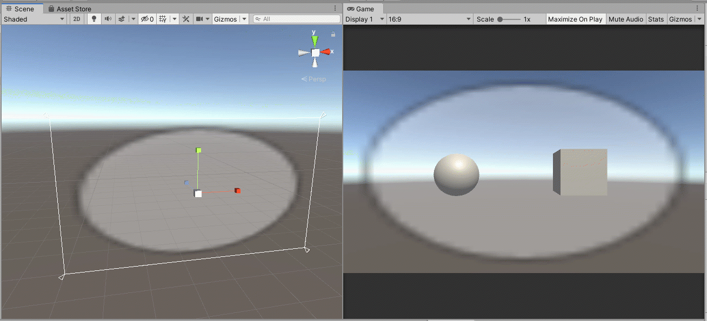
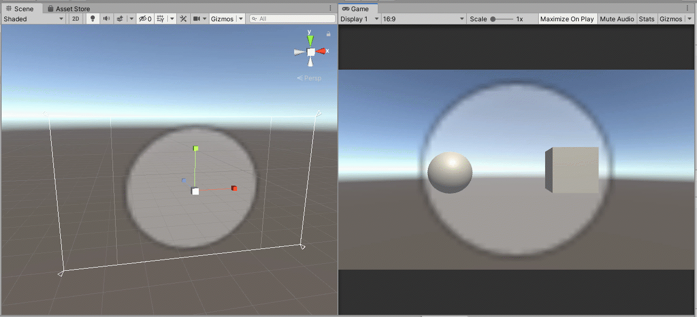
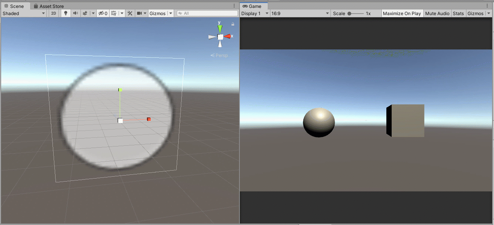

# Week 7-B Raycasting Example \(Unity\)


This activity uses Unity and all code should allow you to copy and paste.

For information on how to create a new Unity project and what each of the windows/tabs mean, please see [Week 5-D Step 1](../week-5/week-5-d-for-and-foreach-loops-in-unity.md).


Be sure to download Visual Studio to make it easier to code in C\# for Unity. Download it here:   
[https://visualstudio.microsoft.com/vs/community/](https://visualstudio.microsoft.com/vs/community/)


## Raycasting

Raycasting is a powerful way \(just like collisions\) to get and update information about an object in Unity.

This activity is a VERY simple example, but this method of having Raycasting from the camera is used in first-person video games and experiences. Rays can be cast from objects as well \(aiming weapons/tools, having code run when an NPC \(non-player character\) is looking at an object, etc.\)

## Starter Scripts

To save time, please download these scripts to help with the movement of the camera.



Inside this file:

**PlayerMovement.cs** - Uses WASD controls to move in directions relative to the object it is attached to. Can be used with other player objects as well.

**RotateCamera.cs** - A script I found years ago and have since modified that uses your mouse to look around. It might not be the most efficient, but it's good for testing other scripts. I also added a code for making the cursor hidden since the rotation will not match and this throws off the user.

## Step 1: Create and Set Up a New Scene

Open a previous Unity project file or create a new one.


The layout in these examples uses a custom layout so both the Scene and Game windows can be viewed at the same time as well as having the Console visible. You can move the tabs and windows around by clicking and dragging the tabs.


### Create a New Scene

Create a new scene in your Project window/tab by going to the default **Scenes** folder, then right-click and choose Create &gt; Scene.


Name your scene. I named this one "Looking at Things."


Double-click on the new scene. This will open the scene in the Hierarchy, Scene, and Game windows.

The name of the scene will be at the top of the Hierarchy window. A scene will have a Main Camera and Directional Light by default. 


### If your scene is still in 2D from Mario

Depending on what you have working on, the Scene window will most likely be in 3D mode by default. You know this is the mode when a directional gizmo exists at the top right.

If you are doing these activities in order, change the scene back to **3D**, click the **2D** toggle button at the top left of the Scene window.


This will switch the scene to a perspective view with a gizmo on the top right.

### Add the Starter Codes

Once you have downloaded and unpacked/extracted the files from the zip files, click and drag them into your Assets folder or a Scripts subfolder in the **Project** window. This will make copies in your Unity project.


## Step 2: Add Starter Scripts to Your Camera

You can:

**Option 1:** Click and drag the scripts onto the Main Camera object in the Hierarchy window

**Option 2:** Select the Main Camera in the Hierarchy window, bringing up the information in the Inspector window. Click and drag the scripts into the Inspector window

**Option 3:** Select the Main Camera in the Hierarchy window, bringing up the information in the Inspector window. Click the **Add Component** button and search for the scripts to add them.


When added correctly, the scripts will appear as components:


You can test the scene by pressing play, but it won't look like much without anything in the scene to show relative distance.

## Step 3: Add Objects

Objects here are just examples to test our Raycasting. When developing projects, simple things are used to test code before using the script in more detailed environments.

I will use a sphere and a cube, but you can use any other primitive 3D shape.

To add a 3D primitive shape object, right-click in the Hierarchy window and select 3D Object and one of the first five shapes.


Rename your objects by right-clicking and selecting Rename.


Move your objects with the **Move Tool**. Press W for a shortcut or click on the Move Tool button on the top left:


You will want to move them closer to the camera and along the same horizon.



Your Scene window might be looking at your scene from a different angle than your Game window. The quickest way to get it to be the same direction, click on the red X end of the gizmo on the top right of your screen to make the cone get bigger on the right \(as pictured\).


You can test the scene now and it is best when viewed with **Maximize On Play** is on. Press ESC to bring the mouse back to stop playing.


## Step 4: Add a User Interface

One form of a user interface appears as a dot in the center of the screen that changes when the ray hits something, often with an added prompt \(what will happen when the player presses a button\).

We can do this with UI \(User Interface\) objects.

Start with a **Canvas** by right-clicking and selecting UI &gt; Canvas.


This will also load an Event System.


By default, the Render Mode is in Screen Space - Overlay so what is on this canvas appears as an overlay of the entire screen. However, in the Scene window, this canvas looks HUGE.


The good news is that the elements can be positioned with the move tool, making it easy to move them.

Add a **Panel** object. \(Create &gt; Panel\)


This should create it as a child object of the Canvas object:


Select the Panel object. In the Inspector window, you'll see that theThe Source Image of the Panel is background by default and appears as a gray overlay.

We want a circle image, so change **Source Image** to **Knob** by clicking on the target/bull's eye icon to the right of the Source Image field in the Inspector window.


This changes the image to a circle. However, it appears as an ellipse because it's trying to match the screen's aspect ratio.


Use the Scale Tool \(top left or press R\) to make it more circle.




Use the Scale Tool to make the circle SUPER tiny - almost dot-like.



How my dot appears:


Select the Panel in the Hierarchy window and duplicate \(right-click &gt; Duplicate or CTRL+D\) the object.

Select the new Panel \(1\) and use the Scale Tool to make the dot slightly, but noticeably larger.



Rename your Panel object to Default Dot and Panel \(1\) to Interact Dot.


Add a Text UI object \(Right-click &gt; UI &gt; Text\).


Rename it to Prompt Text.


The default text says, "New Text" and will place a text object in the center of the screen. It will appear off to the left because it is left-aligned.

In the Inspector window in the Text component:

* Change the alignment to Center-Center
* Change "New Text" to "Interact"
* Change the color to something more noticeable than Dark Gray.


Use the Move Tool to move the text down off of the dots.


## Step 5: Creating a Raycasting Script

Now, we'll write a script that sends an invisible "ray" or line from one position, in a direction and get information about whatever it hits.

Create a new C\# script by right-clicking in the Project window and selecting Create &gt; C\# Script.


Name it something like RaycastingTest.


Double-click the file to open it in the IDE associated with Unity \(usually Visual Studio\).

We will be accessing and updating UI elements, so we need to include the library for UI. Add this to the top of the script immediately after using UnityEngine; and before the code for the class.

```csharp
using UnityEngine.UI;
```

We want the UI to change if our ray hits something so create variables for:

* default dot \(GameObject\)
* interact dot \(GameObject\)
* prompt text object \(GameObject\)
* prompt text message \(Text\)

```csharp
public GameObject defaultDot;
public GameObject interactDot;
public GameObject promptTextObject;
public Text promptText;
```

In the Update\(\) function, create a variable for the object that is hit's information. It's stored in an object type called RaycastHit.

```csharp
RaycastHit hit;
```

Now, our raycast code...

We want to put it in an if statement to have things happen ONLY when the ray hits something.

About this line:

* Raycasting is part of the Physics class that controls all the physics calculations and functions
* Physics.Raycast\(\) can take different numbers of arguments to help determine the position, direction, distance, layer, etc. Details appear once you start typing the beginning parenthesis in Visual Studio.
* out is a way of putting information into a variable - why we are using hit.
* The Transform component will have a function that can determine a direction from the object the transform component is on

The function used here is Physics.Raycast\(Ray ray, out RaycastHit hitInfo, float maxDistance\)

The Ray includes the beginning position and direction of the ray.

```csharp
if (Physics.Raycast(transform.position, transform.TransformDirection(Vector3.forward), out hit, 5))
{

}
```


You'll notice I didn't have == true in the if statement test. It is not needed since it is testing for true or false and having == true is like asking if true == true.


Have the dots switch to the larger dot when true and smaller dot when false. Also, have the prompt only when the ray is hitting something. We can use GameObject.SetActive\(\) to toggle the availability of a game object.

```csharp
void Update()
{
    RaycastHit hit;

    if (Physics.Raycast(transform.position, transform.TransformDirection(Vector3.forward), out hit, 5))
    {
        defaultDot.SetActive(false);    // Turns off Default Dot
        interactDot.SetActive(true);    // Turns on Interact Dot
        promptTextObject.SetActive(true);   // Turns on the prompt text object
    }
    else
    {
        defaultDot.SetActive(true);    // Turns on Default Dot
        interactDot.SetActive(false);    // Turns off Interact Dot
        promptTextObject.SetActive(false);   // Turns off the prompt text object
    }
}
```

Save your script and return to Unity.

Add your RaycastingTest script to your Main Camera object. \(click and drag or use the Add Component button\)


The new component will appear like this when Main Camera is selected:


Update these fields using the click and drag method \(from Hierarchy to the fields in Inspector\) or click on the target/bull's eye icon for each. **Prompt Text** will be the object for both Prompt Text Object and Prompt Text.


Now, test it and see if the dot changes and the text appears when close enough to an object and looking at it.


## Step 6: Different Things, Different Effects

Let's make each object act differently.

I want to make the sphere \(Thing 1\) get bigger as I hold the mouse button down and make the cube \(Thing 2\) change color.

### Make the Sphere Get Bigger

Go to your RaycastingTest script.

In your Raycasting if statement, add another if statement to get the name of the hit object and compare it to the one you want. Generally, you can access the name through the gameObject, but in this case, we can access the Transform component and get it there.

```csharp
if (hit.transform.name == "Thing 1")
{

}
```


Remember, the name of the object in your Hierarchy window needs to match the name string here exactly - case and spaces!


When it hits, we want to change the prompt text to "Make Bigger." We can update this through updating the text of the Prompt Text.

```csharp
promptText.text = "Make Bigger";
```

 We want it to grow only when the left button is being pressed, so we can use the Input class' GetMouseButton\(\) function where the left button is zero.

```csharp
if (Input.GetMouseButton(0))
{

}
```

We can then use the transform component of the thing we hit to make it grow.

```csharp
if (hit.transform.name == "Thing 1")
{
    promptText.text = "Make Bigger";
    
    if (Input.GetMouseButton(0))
    {
        hit.transform.localScale += new Vector3(0.1F, 0.1F, 0.1F);      // Increases by 0.1 units per frame
    }
}
```

Full code so far:

```csharp
using System.Collections;
using System.Collections.Generic;
using UnityEngine;
using UnityEngine.UI;

public class RaycastingTest : MonoBehaviour
{
    public GameObject defaultDot;
    public GameObject interactDot;
    public GameObject promptTextObject;
    public Text promptText;

    // Start is called before the first frame update
    void Start()
    {
        
    }

    // Update is called once per frame
    void Update()
    {
        RaycastHit hit;

        if (Physics.Raycast(transform.position, transform.TransformDirection(Vector3.forward), out hit, 5))
        {
            defaultDot.SetActive(false);    // Turns off Default Dot
            interactDot.SetActive(true);    // Turns on Interact Dot
            promptTextObject.SetActive(true);   // Turns on the prompt text object

            if (hit.transform.name == "Thing 1")
            {
                promptText.text = "Make Bigger";
                
                if (Input.GetMouseButton(0))
                {
                    hit.transform.localScale += new Vector3(0.1F, 0.1F, 0.1F);      // Increases by 0.1 units per frame
                }
            }
        }
        else
        {
            defaultDot.SetActive(true);    // Turns on Default Dot
            interactDot.SetActive(false);    // Turns off Interact Dot
            promptTextObject.SetActive(false);   // Turns off the prompt text object
        }
    }
}

```

Save your script and test it in Unity!

### Change the Color of the Cube

We first need to create materials for the cube.

Create a Material in your Project window and in a Materials subfolder if you have one.

Right-click &gt; Create &gt; Material

Name the first after whatever you plan to make the color.


Select the material to bring up information in the Inspector window.

Change the color of the Albedo by clicking on the color swatch \(white by default\) and choosing a color from the square that pops up.


Create another Material the same way, choosing a different name and color.


Click and drag the material onto the cube \(Thing 2\) object in the Scene window or into the cube's Inspector window info.


Go to your RaycastingTest script in Visual Studio.

Add variables for the two materials and a number to keep track of the color.

```csharp
 public Material red;
 public Material green;
 public int colorNumber = 0;     // 0 = red 1 = green
```

Save your script and return to Unity.

Once the component updates, select your Main Camera to see your Raycasting Test component in the Inspector window.


Click and drag the materials from the **Project** window or use the target/bull's eye icon to assign your materials.


Go back to the script in Visual Studio.

Now, we can use the same method we used before to see if the object our ray hits is the cube \(Thing 2\).

```csharp
if (hit.transform.name == "Thing 2")
{
      
}
```

Update the prompt text to say, "Change color."

```csharp
promptText.text = "Change Color";
```

Let's have it change color when the mouse clicks, NOT when held down, otherwise, it will change every frame instead of once with a click.

```csharp
if (Input.GetMouseButtonDown(0))
{

}
```

We can access whatever components are on the thing we hit and primitives come with a Mesh Renderer that we can access through GetComponent&lt;Renderer&gt;\(\) to then access the material.

```csharp
if (colorNumber == 0)
{
    // Change to green
    hit.transform.gameObject.GetComponent<Renderer>().material = green;
    colorNumber = 1;
}

else
{
    // Change to red
    hit.transform.gameObject.GetComponent<Renderer>().material = red;
    colorNumber = 0;
}
```

## Full Code

```csharp
using System.Collections;
using System.Collections.Generic;
using UnityEngine;
using UnityEngine.UI;

public class RaycastingTest : MonoBehaviour
{
    public GameObject defaultDot;
    public GameObject interactDot;
    public GameObject promptTextObject;
    public Text promptText;

    public Material red;
    public Material green;
    public int colorNumber = 0;     // 0 = red 1 = green

    // Start is called before the first frame update
    void Start()
    {
        
    }

    // Update is called once per frame
    void Update()
    {
        RaycastHit hit;

        if (Physics.Raycast(transform.position, transform.TransformDirection(Vector3.forward), out hit, 5))
        {
            defaultDot.SetActive(false);    // Turns off Default Dot
            interactDot.SetActive(true);    // Turns on Interact Dot
            promptTextObject.SetActive(true);   // Turns on the prompt text object

            if (hit.transform.name == "Thing 1")
            {
                promptText.text = "Make Bigger";

                if (Input.GetMouseButton(0))
                {
                    hit.transform.localScale += new Vector3(0.1F, 0.1F, 0.1F);      // Increases by 0.1 units per frame
                }
            }

            if (hit.transform.name == "Thing 2")
            {
                promptText.text = "Change Color";

                if (Input.GetMouseButtonDown(0))
                {
                    if (colorNumber == 0)
                    {
                        // Change to green
                        hit.transform.gameObject.GetComponent<Renderer>().material = green;
                        colorNumber = 1;
                    }

                    else
                    {
                        // Change to red
                        hit.transform.gameObject.GetComponent<Renderer>().material = red;
                        colorNumber = 0;
                    }
                }
            }
        }
        else
        {
            defaultDot.SetActive(true);    // Turns on Default Dot
            interactDot.SetActive(false);    // Turns off Interact Dot
            promptTextObject.SetActive(false);   // Turns off the prompt text object
        }
    }
}


```

Save your script and test it!


