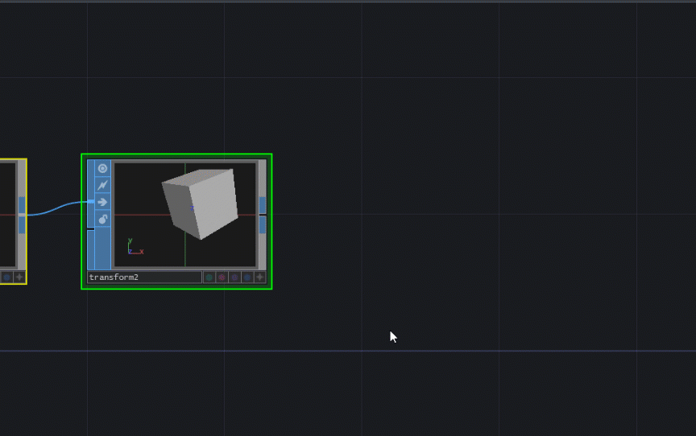
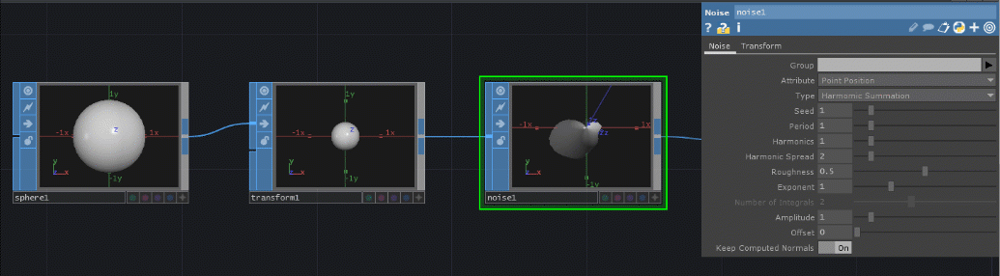

# Popular SOPs

Surface operators \(SOPs\) are colored blue and manipulate 3D objects.

## Extra for 3D

For 3D scenes, you'll need the following:

* Light COMP
* Camera COMP
* Geometry COMP \(see below how to do this with pre-existing 3D objects\)
* Render Top

Adding each will set them up without adding more connections.

### Make a Geometry COMP from your SOP

How it should look when everything is added:

## Basics

### Null SOP

Provides a snapshot of sorts of a point within your network. Commonly used to help look at the effects of major changes later and remove them easily when necessary.

### Noise SOP

For when you want some randomness.

### Switch SOP

Takes in multiple surface operators \(SOPS\) and creates an array. A single element of the array can be accessed by the Switch SOP's Index parameter. 

## Shapes / Primitives / Transforms

### Box SOP, Sphere SOP, Torus SOP, Text SOP

Creates 3D shapes or text.

### Transform SOP

Manipulates position, rotation, scale, etc.

