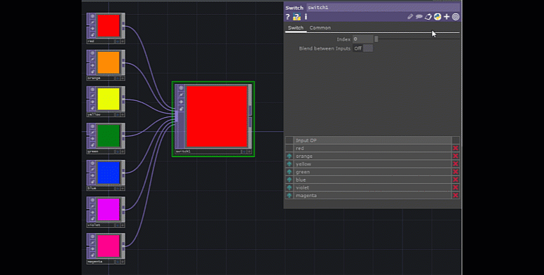

# Popular TOPs

Texture operators \(TOPs\) are colored purple and manipulate 2D images and videos.

## Basics

### Null TOP

Provides a snapshot of sorts of a point within your network. Commonly used to help look at the effects of major changes later and remove them easily when necessary.

### Constant TOP

Provides a solid color chosen by a color picker or RGB values. Can adjust transparency.

### Noise TOP

For when you want some randomness.


Using **absTime.seconds** in different parameters can make this move!


### Switch TOP

Takes in multiple texture operators \(TOPS\) and creates an array. A single element of the array can be accessed by the Switch TOP's Index parameter. ALSO, for TOPs, you can blend between each element. This is great for fading in and out images and videos or representing number values as shades of color.

## Effects

### Blur TOP

Adds Blur

### Crop TOP

Crops image

### Mirror TOP

Mirrors part of the image.

## Shapes / Primitives / Transforms

### Circle TOP, Rectangle TOP, Text TOP

Creates shapes or text

### Transform TOP

Manipulates position, rotation, scale, etc.

## Images and Videos

### Movie File In TOP

Load any image or video. This banana image is a default image.

### Movie File Out TOP

Exports animation, image, and video files.

### Video Device In TOP

Webcam or any other camera attached.

### Video Device Out TOP

A way to output to a video device.

## Blending Modes

The best one is Composite TOP where you can choose the mode within the parameters, but TOPs exist for individual modes.

### Composite TOP

Blends two TOP operators into a single image - similar to blending two Photoshop layers. The layer mode can be updated through the Operation parameter.

